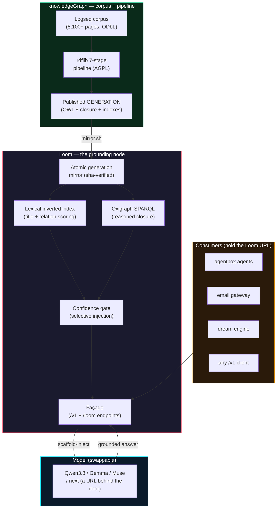

<div align="center">

# Ontology Loom

### Grounding node for the Dynamic Agentic Mesh

[](Cargo.toml)
[](Cargo.toml)
[](docs/design/RUST-ARCHITECTURE.md)
[](#what--the-fa%C3%A7ade)

**One endpoint. One corpus generation. The model is always a URL behind the door.**

**Maintainer**: [John O'Hare](https://github.com/jjohare) · **Upstream IP**: [Melvin Carvalho](https://github.com/melvincarvalho) ([JSS](https://github.com/JavaScriptSolidServer/JavaScriptSolidServer), [DID:Nostr](https://github.com/nicholasgasior/did-nostr)) · [knowledgeGraph pipeline](https://github.com/jjohare/logseq)

[Why](#why--the-measured-result) · [Façade](#what--the-façade) · [Quickstart](#quickstart) · [Ecosystem](#where-loom-sits) · [Status](#status--honesty) · [Docs](docs/README.md)

</div>

---

> **Your LLM doesn't know your data — Loom makes any LLM answer from it, verifiably.** Point any OpenAI-compatible client at one URL and every answer is grounded in your curated, reasoner-checked private corpus: recall on in-domain questions rises from as low as 0.15 to ~0.94, faster than the bare model, with every claim traceable to a corpus generation. The model is just a URL behind the door — swap it for the next one and nothing else changes, because the knowledge lives in the corpus you govern, not the weights you rent.

---

## What is Loom?

Loom is the **grounding door**: a single-binary Rust node that serves a reasoned ontology into an LLM's context at query time, behind a stable, model-swappable façade. Three verbs describe what it exists to give an operator — **ground** an LLM's answers in checked formal semantics rather than parametric guesses, **swap** the model behind the door without any consumer change, and **measure** the value of that grounding against a reproducible benchmark with bootstrap confidence intervals.

Instead of thick agents wired to raw data, Loom implements the architecture the 2026 industry calls **neurosymbolic** — thin agents on a shared formal semantic layer. The layer is an OWL 2 ontology compiled from a curated corpus; Loom serves it. The reasoner (Whelk EL++) checks it at build time; the model restates it at query time. The invariant — one human-reviewable markdown block per IRI as the single served, auditable unit — is enforced by the crate architecture, not by convention. That is **THE PRIZE**, and it is the whole point of the node.

**What it is *for*: making swappable models performant against large, important, private customer datasets** — answering accurately and attributably on an in-domain corpus the model could never know parametrically, and delivering that curated, vetted knowledge faithfully and cheaply. The bar is **multivariate**: excellent recall on the locally-grounded questions, *without going jagged* on the general or novel ones. Full framing: [`docs/design/LOOM-POSITIONING.md`](docs/design/LOOM-POSITIONING.md).

---

## Where Loom sits

Loom is one component of **[VisionFlow](https://github.com/DreamLab-AI/VisionFlow)** — a seven-repo effort built on a simple wager: hierarchy was an information-routing protocol bounded by human bandwidth, AI collapses the cost of that routing toward zero, and so the human role is not eliminated but **promoted from router to judgment broker**. Loom is the context-assembly layer of that mesh — it serves the shared semantic layer that bounds what agents can assert; the siblings build, reason over, store and govern what flows through it.

| Repo | Role |
|:-----|:-----|
| [VisionFlow](https://github.com/DreamLab-AI/VisionFlow) | Ecosystem canon — ADRs, PRDs, compatibility matrix, vision report, marketing site |
| [VisionClaw](https://github.com/DreamLab-AI/VisionClaw) | Flagship engine — OWL 2 EL + Whelk reasoning, 82 CUDA kernels of GPU graph physics, one renderer shared desktop↔headset |
| [agentbox](https://github.com/DreamLab-AI/agentbox) | Sovereign agent runtime — Nix-built container, `did:nostr` identities, 116 skills, RuVector memory, Solid pod bridge |
| **Loom** (this repo) | **Grounding node — portable, model-swappable façade that serves the reasoned ontology into any model's context at query time** |
| [solid-pod-rs](https://github.com/DreamLab-AI/solid-pod-rs) | Rust Solid pod server — the personal-data-sovereignty layer under each human's and agent's own key |
| [nostr-rust-forum](https://github.com/DreamLab-AI/nostr-rust-forum) | Nostr-native forum + relay — the one place a human decision gets cryptographically signed |
| [dreamlab-ai-website](https://github.com/DreamLab-AI/dreamlab-ai-website) | DreamLab AI company website — the commercial face, a thin consumer of the forum kit |
| [knowledgeGraph](https://github.com/DreamLab-AI/knowledgeGraph) | The published corpus at [narrativegoldmine.com](https://narrativegoldmine.com) — Logseq→OWL pipeline, 8,100+ pages, ODbL-1.0 |

Each sibling in its own words:

<details>
<summary><b>VisionFlow</b> — <em>Ecosystem canon</em></summary>
<br/>

> **Six honest systems can still assemble one collective lie — VisionFlow is the canon that stops that.** It holds the ADRs, PRDs, compatibility matrix and honest status ledger for a seven-repo human–AI mesh built on one wager: AI collapses the cost of routing information, so the human is promoted from router to judgment broker. This repo ships words, not runtime — and it is graded on their accuracy.

</details>

<details>
<summary><b>VisionClaw</b> — <em>Flagship engine</em></summary>
<br/>

> **Agent swarms are invisible; VisionClaw makes them something you can stand inside and watch.** It reasons over a curated corpus with an OWL 2 EL engine (Whelk, 5,975 classes), settles the result as a 3D graph under GPU physics, and renders agents acting inside it — desktop and Quest 3 alike, every agent action drawn as a beam to the concept it touched. It observes and never signs: the engine you can watch is deliberately not the surface that can commit.

</details>

<details>
<summary><b>agentbox</b> — <em>Sovereign agent runtime</em></summary>
<br/>

> **An agent runtime you can't reproduce is an audit you can't run — Agentbox is a byte-for-byte reproducible Nix container driven by one TOML manifest.** Every agent is minted its own `did:nostr` key at spawn, every durable write passes a privacy filter into a cryptographic audit trail, and what agents may touch is bounded by explicit fail-closed gates. Reproduce the runtime, audit every action, control every capability.

</details>

<details>
<summary><b>solid-pod-rs</b> — <em>Rust Solid pod server</em></summary>
<br/>

> **Your data's exit right should sit in the floor, not be granted at the door — solid-pod-rs gives every human and agent a self-owned RDF pod under their own key.** A Rust-native Solid Protocol server with WAC access control and `did:nostr` identity; every write is a git-mark commit and high-value writes anchor to Bitcoin. Standards-based sovereignty: leave at any time, and take everything with you.

</details>

<details>
<summary><b>nostr-rust-forum</b> — <em>Nostr-native forum + relay</em></summary>
<br/>

> **Machine coordination is cheap; accountable decisions are not — this forum is the one place in the mesh where a decision gets signed.** Humans and agents are the same kind of participant: each holds a `did:nostr` keypair and publishes Schnorr-signed events to an immutable log, so every governance outcome carries a human signature by construction. The kit ships vanilla — one TOML file stands up a community, no forking.

</details>

<details>
<summary><b>dreamlab-ai-website</b> — <em>DreamLab AI company website</em></summary>
<br/>

> **The commercial face of the mesh, running on the mesh's own rails.** A React marketing site and a Rust/Leptos WASM community forum share one Cloudflare-edge origin, end-to-end encrypted where it matters. It is deliberately a thin consumer of the nostr-rust-forum kit — branding and zone config live here, the protocol lives upstream — living proof the kit stands up a real community without a fork.

</details>

<details>
<summary><b>knowledgeGraph</b> — <em>The published corpus</em></summary>
<br/>

> **8,100+ ordinary Logseq markdown pages that compile losslessly into a formal OWL 2 ontology — pure TBox, every page a class, zero individuals by design.** Corpus, pipeline, viewer and method ship as one open release (ODbL-1.0 data, AGPL-3.0 pipeline) published at narrativegoldmine.com; siblings reason over it (VisionClaw) and serve it as measured LLM grounding (Loom, ~0.94 grounded recall). Rigorous curation is amortised once and reused per query — this repo is the once.

</details>

```
knowledgeGraph  ──publishes──▶  a corpus GENERATION (OWL + reasoned closure + indexes)
 (corpus + pipeline + method)         │
   built by jjohare/logseq            ▼  mirror
                                  ┌─────────┐   scaffold-inject     ┌────────────┐
   agents / email / any client ──▶│  LOOM   │───────────────────▶ │  the model  │
        (hold the Loom URL)       │ façade  │◀───────────────────  │ (swappable) │
                                  └─────────┘   grounded answer     └────────────┘
                                      ▲
                              VisionClaw reasons over the same corpus (OWL 2 EL, Whelk-rs)
```

Loom is the *serving* half of a neurosymbolic pair. Its sibling [knowledgeGraph](https://github.com/DreamLab-AI/knowledgeGraph) is the corpus, the pipeline and the method — *how the ontology gets built*. Loom is *how that checked graph gets served to ground an LLM at runtime*. Agentbox is a **client** of Loom's façade: the "one brain" ontology retrieval resolves through Loom ([ADR-051](docs/design/agentbox-ADR-051-loom-client-and-deferred-distillation.md)) instead of re-deriving index state locally, and deferred-distillation MCP tools let an agent submit a grounding job mid-turn, then await and fetch it out-of-band.

**Self-improvement.** The fleet dreams through this door: a nightly [dream cycle](https://github.com/DreamLab-AI/dream-engine) queries the reasoned ontology so hypotheses restate checked facts, not parametric guesses — then opens a draft PR a human merges. *Evaluation is not promotion.*

---

## Why — the measured result

Grounding an LLM in a formal ontology is not a hunch here; it is measured. On a held-out, objective benchmark (37 questions, gold answers derived from the graph itself, paired raw-vs-grounded scoring with bootstrap 95% confidence intervals — `bench/`), static ontology scaffolding is a **decisive, model-agnostic win**:

| Model | Raw (parametric) | + Loom scaffold | Paired uplift (95% CI) | Latency |
|---|---|---|---|---|
| Gemma-4-31B (local) | 0.146 | **0.939** | **+0.793** [+0.680, +0.894] | 31.5 s → 5.1 s |
| Muse-Glimmer-30B (local) | 0.268 | **0.939** | **+0.671** [+0.527, +0.804] | 34.7 s → 9.8 s |
| Gemini 3.7 Flash (cloud) † | 0.359 | **0.942** | **+0.583** [+0.546, +0.618] | 2.4 s → 1.2 s |

Three different models — two local, one a frontier cloud model — all land at **~0.94** grounded, from wildly different parametric baselines, and grounding is **faster in every case**. The lift concentrates where you'd want it — the niche domains a model doesn't already know (spatial-computing 0.23→0.97, distributed-collaboration 0.22→0.95) — and adds least where the model is already right. The stronger the model, the smaller the *uplift* it needs, but the grounded ceiling is the same. That is the whole bet of the swappable façade: the scaffold carries the recall, not the model behind the door.

† First cloud model benched (2026-08-16, `gemini-3.7-flash`), on a larger set — 510 questions vs 37 local. `temp=1.0`, `reasoning_effort=low`, `max_tokens=2048`. The *paired* delta is within-model and stays valid; absolute raw recall is not cell-for-cell comparable. Full provenance: [`docs/research/report-gemini-3.7-flash.md`](docs/research/report-gemini-3.7-flash.md).

**What that uplift *is*, measured.** The paper *An Input-Exposure Control for Ontology Grounded Generation over Private Corpora* ([`docs/research/paper-v3/main.pdf`](docs/research/paper-v3/main.pdf)) went further: it introduces a *copy ceiling* (recall a verbatim copy would already score) and reports the signed *gain over copy*. On this node the copy ceiling is 0.964; across ten models from five providers the gain over copy is uniformly negative (−0.067 to −0.022). The reading: the model adds **faithful delivery of the exposed facts, not reasoning over the injected structure** — exactly the product for private-knowledge grounding, where the answer is trustworthy because the curated source is.

Three findings shaped Loom's defaults:

1. **Static structured scaffold is the product.** The taxonomy + typed-relation + definition extract carries the value. `POST /loom/scaffold` is this, and it works with no model at all.
2. **Prose adds nothing over structure** (+0.007 Muse / +0.000 Gemma). Loom ships prose off the default path — it costs budget for no recall.
3. **Agentic tool-traversal is model-dependent.** Gemma's best axis (0.973) but Muse's worst (0.649). So Loom defaults to *inject*, not *traverse*; the tools path stays available for models that traverse well.

Evidence index: [`docs/research/README.md`](docs/research/README.md).

---

## What — the façade

One deployment-agnostic contract (`ADR-135` D1). The model is always a URL behind it (`DISTILL_BACKEND_URL`), never baked into the endpoint:

| Endpoint | Purpose | Needs a model? |
|---|---|---|
| `GET  /health` | liveness + corpus generation stamp + backend/graph/index readiness | no |
| `GET  /loom/generation` | the corpus generation identity being served | no |
| `POST /loom/scaffold` | budget-clamped ontology grounding for a prompt (the retrieval facet) | **no** |
| `POST /loom/sparql` | read-only, clamped SPARQL over the reasoned closure | no |
| `POST /loom/search` | label/substring search over the store | no |
| `POST /v1/chat/completions` | scaffold-inject the last user message → delegate to the model | yes |
| `GET  /v1/models` | model identity passthrough (probe what's behind the façade) | yes |

```bash
# grounding, no model required — works anywhere the corpus is mirrored
curl -sXPOST localhost:8084/loom/scaffold \
  -d '{"prompt":"how do zero-knowledge proofs relate to blockchain scalability?","budget_tokens":700}'

# grounded generation — scaffold-injected, then delegated to the model behind the façade
curl -sXPOST localhost:8084/v1/chat/completions \
  -d '{"model":"qwen3.8-27B","messages":[{"role":"user","content":"what is a rollup?"}],"max_tokens":1536}'
```

The response of a grounded completion carries a `loom` block (`injected_tokens`, `mode`, `grounding`, `fusion_path`, `generation`) so consumers can account for the grounding and prove which corpus generation produced the answer.

### Confidence-aware selective injection

Grounding is only helpful when the query is actually on-ontology. Research on *contextual interference* shows that injected context can **displace** the model's own parametric knowledge — models over-rely on retrieved evidence even when it is weak or off-topic. Loom uses the retrieval score as the confidence signal: a strong exact-title hit gets the full scaffold budget; a loose match gets a proportionally smaller one; a below-threshold match is skipped entirely.

| Env var | Default | Meaning |
|---|---|---|
| `LOOM_CONFIDENCE_INJECTION` | `0` (repo) / `1` (HP compose) | master switch |
| `LOOM_STRONG_MATCH_SCORE` | `8.0` | at/above → full budget |
| `LOOM_MIN_INJECT_SCORE` | `2.0` | below → skip injection entirely |
| `LOOM_MIN_INJECT_FRACTION` | `0.4` | weakest kept match gets this fraction of budget |

### Findings-driven serving controls

Three controls, each shipped default-off, following the paper's serving-regime finding:

- **Verbatim serving** (`LOOM_VERBATIM_MODE`) — on a high-confidence lookup, serve the canonical markdown block directly and skip the model call entirely. The serving-regime finding made operational.
- **Exposure telemetry** (`LOOM_EXPOSURE_APPEND`) — the `loom` block carries a per-answer `exposure` object (targets/delivered/dropped); this opt-in also appends a "Not covered above" line when titles are dropped.
- **Thinking control** (`LOOM_BACKEND_NO_THINK`, `LOOM_THINK_TOKEN_FLOOR`) — disable reasoning on gate-engaged requests and hold a token floor so reasoning cannot starve the answer.

Protocol detail: [`bench/UPLIFT-BENCH-PROTOCOL.md`](bench/UPLIFT-BENCH-PROTOCOL.md).

---

## Quickstart

Loom is a **single static Rust binary** — no interpreter, no wheel. The workspace is an eight-crate hexagonal ring (`ADR-090`): a pure `loom-domain` core with port traits, five adapters, the `loom-scaffold` policy crate, and a thin `loom-facade` axum binary.

### Build & test

```bash
git clone https://github.com/DreamLab-AI/loom.git
cd loom
just            # list recipes
just build      # gate 1 — compiles on BOTH feature planes (all-features + no-default-features)
just test       # gate 2 — byte-golden scaffold parity, SPARQL clamp, router oneshot
just clippy     # gate 3 — clippy pedantic, warnings-as-errors
just deny       # gate 4 — licence + advisory gate (deny.toml)
just ci         # the full green bar (gates 1–4)
```

### Deploy

Two compose profiles (`ADR-137` D8; files under `deploy/`):

```bash
just docker-build     # multi-stage static musl build
just docker-run-a     # Profile A — host-colocated on HP (network_mode: host, :8084)
just docker-run-b     # Profile B — sidecar on visionclaw_network (:8080)
```

- **Profile A — host-colocated on HP (reference).** GPU-colocated with the model (`loom-model` Qwen3.8-27B on `:8085`); the augmentation hot path is fully in-process. `hp-nat.service` DNATs `:8084` onto the LAN.
- **Profile B — sidecar on `visionclaw_network`.** GPU-free, delegates the model by URL; it is the consumer-facing door (the email gateway binds `REASONER_BASE_URL=http://loom:8080/v1`).

Both profiles serve **byte-identical generations** for the same `commitSha`. The corpus is not baked: `app/mirror.sh` pulls the published, sha-addressable generation from [narrativegoldmine.com](https://narrativegoldmine.com) atomically, so Loom always serves a known generation.

Since 2026-08-14 the reference deployment ships the model engine **inside this stack**: the `loom-model` container serves **Qwen3.8-27B** (Heretic abliterated Q8_0, ~19.5 tok/s) via llama.cpp on `:8085` (262 K native context, embedded-MTP speculative decoding n=3). Model reference: [`docs/QWEN3.8-CONNECTION.md`](docs/QWEN3.8-CONNECTION.md). Connect a LAN machine: [`docs/REMOTE-CLIENT-SETUP.md`](docs/REMOTE-CLIENT-SETUP.md).

---

## Architecture



The crate graph is the enforcement mechanism for THE PRIZE: an adapter physically cannot return its own row/triple/vector shape as the served unit, because only `loom-domain` mints a `CanonicalUnit`. Design: [`docs/design/RUST-ARCHITECTURE.md`](docs/design/RUST-ARCHITECTURE.md).

---

## Boundary — the Loom is the ontology only

The Loom serves the **published ontology** (the reasoned generation) and nothing else. It **never reads or mirrors the working graph** (personal/working notes, which may become multi-user or private). Uplift *into* the ontology happens through VisionClaw's governed propose door, the forum/ACSP surface, or direct agentic writes into the corpus — never the Loom; the new generation is then mirrored here read-only.

---

## Status & honesty

Honest state as of **2026-08-18**. Maturity words follow the ADR-002 ladder (*scaffolded / integrated / released*). Loom is a research/dev system on the DreamLab estate; this section is the honest split between what is built and what is gated off.

| Capability | Maturity | Honest boundary |
|:-----------|:---------|:----------------|
| Lexical retrieval + confidence-gated injection | released | Ported constant-for-constant; served markdown byte-identical to the Python original on golden fixtures. |
| Native oxigraph SPARQL | released | Read-only clamp *stronger* than Python's (PREFIX/BASE-prologue-aware LIMIT injection). |
| The façade (all `/v1/*` and `/loom/*` endpoints) | released | Both compose profiles, `max_tokens` floor, atomic generation-verified mirror. |
| Corpus generation served | released | 8,146 concept classes, ~282k triples in the reasoned closure, one sha-addressable generation. |
| Findings-driven serving controls (F1–F3) | integrated | Verbatim serving, exposure telemetry, thinking control — wired, default-off, per-deployment opt-in. |
| HNSW semantic fallback (RuVector) | gated off | Recall gate RED: `rgb-protocol 0.816`, below `0.87` design floor. Wiring done and tested; the default does not change until the multivariate bench passes. |
| Two-profile generation parity (A≡B) | integrated | Code implements both; the live health assertion runs at deployment cutover. |
| Platform for any ontology connector | planned | Stated plainly: today Loom is one node with a provider-plugin seam. "Platform" is earned when a second provider lands. |

The eight-crate hexagonal Rust workspace is built, gate-green (`just ci`), and was adversarially audited by a different model family (gpt-5.4) with all five findings remediated — [`.claude/evidence/AUDIT-gpt54.md`](.claude/evidence/AUDIT-gpt54.md).

**Provenance.** The corpus it serves is **AI-generated synthetic content produced under human direction, by design** — an ontology testbed, not an authoritative encyclopaedia. Every grounded answer is traceable to a corpus generation; that provenance attests traceable generation, not human authorship.

---

## Documentation

**Operators** — [Docs hub](docs/README.md) · [Qwen3.8 connection](docs/QWEN3.8-CONNECTION.md) · [Remote client setup](docs/REMOTE-CLIENT-SETUP.md) · [Bench protocol](bench/UPLIFT-BENCH-PROTOCOL.md)

**Design** — [PRD-025](docs/design/PRD-025-ontology-loom-and-connector-platform.md) (product capstone) · [ADR-135](docs/design/ADR-135-ontology-loom-node.md) (keystone node boundary) · [ADR-137](docs/design/ADR-137-loom-rust-replatform.md) (Rust re-platform) · [RUST-ARCHITECTURE.md](docs/design/RUST-ARCHITECTURE.md) (build blueprint) · [DDD bounded context](docs/design/ddd-ontology-loom-context.md) · [Positioning](docs/design/LOOM-POSITIONING.md) · [agentbox ADR-051](docs/design/agentbox-ADR-051-loom-client-and-deferred-distillation.md) (harness client)

**Research** — [Evidence index](docs/research/README.md) · [Input-exposure control paper](docs/research/paper-v3/main.pdf) · [Ontology uplift report](docs/research/ontology-uplift-report.pdf) · [Gemini 3.7 Flash report](docs/research/report-gemini-3.7-flash.md) · [Local model report](docs/research/report.md)

**Audit** — [Evidence directory](.claude/evidence/) · [gpt-5.4 adversarial audit](.claude/evidence/AUDIT-gpt54.md)

---

## Licence

Code: [AGPL-3.0-only](Cargo.toml). Running Loom as a hosted service requires making the full source (including modifications) available to users. Self-hosted and internal use carry no obligations beyond standard copyleft terms. Corpus/data terms: see the sibling [knowledgeGraph](https://github.com/DreamLab-AI/knowledgeGraph) licensing (ODbL-1.0 for the corpus, AGPL-3.0 for the pipeline).

---

<div align="center">

**Part of [VisionFlow](https://github.com/DreamLab-AI/VisionFlow)** — Loom grounds the answers; [VisionClaw](https://github.com/DreamLab-AI/VisionClaw) reasons over the same corpus; [agentbox](https://github.com/DreamLab-AI/agentbox) runs the agents; [solid-pod-rs](https://github.com/DreamLab-AI/solid-pod-rs) stores sovereignly; the [forum](https://github.com/DreamLab-AI/nostr-rust-forum) and [website](https://github.com/DreamLab-AI/dreamlab-ai-website) provide governance and operator surfaces.

[Documentation](docs/README.md) · [Issues](https://github.com/DreamLab-AI/loom/issues) · [Evidence](.claude/evidence/)

</div>
