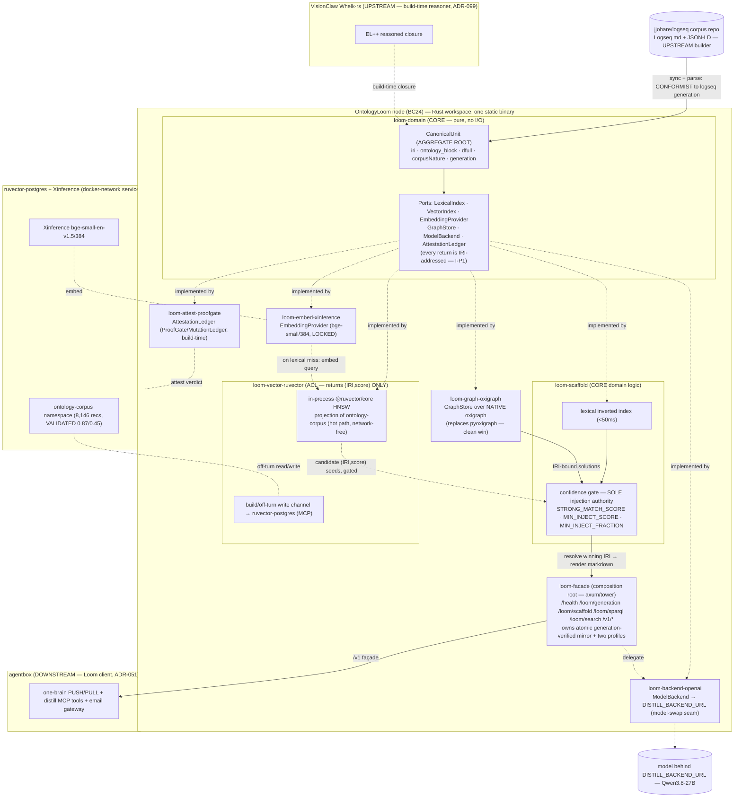

# DDD: Ontology Loom Bounded Context (Rust rev)

**Subtitle:** the CanonicalUnit aggregate root realised as a hexagonal Rust workspace — `loom-domain` ports and the `ruvector` / `xinference` / `oxigraph` / `backend` adapters behind the served markdown
**Context name:** `OntologyLoom` (BC24 — provisional, pending BC catalogue update; see §12)
**Revision date:** 2026-08-17 (supersedes the 2026-08-16 *rev* in place; that revision remains the source for the tooling-allocation model this one re-platforms)
**Author:** Loom platform team (Rust re-platform reframe, grounded in the landed ontology-corpus RuVector namespace)
**Status of this revision:** authority for the bounded-context model *after the substrate change*. It is subordinate to **ADR-137** (the Rust re-platform decision record) and operationalised by **PRD-027** (the re-engineering requirements). It **extends** ADR-136 (tooling allocation unchanged) and ADR-135 (node boundary unchanged); it does not relitigate their decisions. **This is a DESIGN-phase document: the Rust workspace described here is designed, not built.** The shipped Loom today is the stdlib-Python node in `app/`. Every crate in §5 is marked accordingly.

---

> **THE PRIZE (quoted verbatim — the non-negotiable driver of every decision below):**
>
> The one canonical, load-bearing artifact of this system is the per-IRI human-scrutible unit: one block of curated research prose (dfull, corpusNature: synthetic-ai-generated-human-directed) headed by its typed ontology relations (subClassOf, requires/enables/implements/uses/relatedTo/contrastsWith), that a human can read, review and audit end-to-end at single-entity granularity. Everything else — HNSW vectors, the lexical inverted index, pyoxigraph SPARQL, mincut, GNN, ProofGate ledgers — is an accelerator that indexes, finds, ranks and attests THAT unit. None of them ever becomes the thing served in its place, and none ever becomes the thing a human must trust instead of the markdown. We explicitly reject the GraphRAG/G-Retriever trajectory where knowledge degrades into opaque LLM community summaries or GNN-encoded subgraphs; our attribution granularity — one reviewable markdown per IRI, behind a propose→consistency-check→human-PR-merge gate — is the real, non-eroding moat (mesh Facet 4). Every decision in the design docs is subordinate to keeping this unit primary and legible; any design that reduces its legibility is a REGRESSION to be justified with a documented answer-quality trade, not a default.

---

## 0. What this revision changes

The 2026-08-16 *rev* settled the **tooling allocation**: which retrieval, reasoning and attestation machinery is the Loom's own and which is an accelerator behind the markdown. It did that on the Python substrate — a deliberately stdlib `http.server` façade (ADR-135 D1), a `pyoxigraph` binding for SPARQL, and a lexical matcher in `ontology_scaffold.py`, with the HNSW semantic fallback named (ADR-136 D3) but not built.

Two things have since changed on the ground, and they are the whole reason for this revision:

1. **The semantic fallback's ground truth landed.** The `ontology-corpus` RuVector namespace now holds **8,146 concept classes embedded** (Xinference `bge-small-en-v1.5`/384-dim, LOCKED per ops law), generation-stamped, IRI-keyed (`urn:ngm:class:<slug>`, `source_type=loom`), in `ruvector-postgres` under the cosine HNSW index (`idx_memory_embedding_hnsw`, `m=16`, `ef_construction=128`). Spot-checked recall via `hnsw-xinference` (post-ingest, live): rgb-protocol 0.87, single-use-seals 0.82, sovereign-keyset 0.75 vs decoys ~0.45 — a spot-check across several concepts, **not** a formal recall-gate (band self≥175/200); that gate run is pending. The gap ADR-136 D3 named — OOV/paraphrase queries the lexical matcher structurally misses — now has an actual, measured index to fill it. It remains **benchmark-gated and default-off**.
2. **The operator committed the Rust re-platform** (ADR-137 / PRD-027). The Loom moves from stdlib Python to a single-binary Rust node (axum/tokio, hexagonal crates). This is a **substrate change, not a feature change**: it turns `pyoxigraph` from a foreign-language binding into a direct native-Rust `oxigraph` crate dependency (a clean win), turns the HNSW fallback into an in-process read rather than an MCP/network round-trip, and makes THE PRIZE *structural* by encoding the accelerator boundary in the type system (a hexagonal ring) rather than in prose discipline.

This revision therefore makes three structural moves on top of the 2026-08-16 model:

1. **The bounded contexts are re-expressed as CRATES.** The five logical contexts of the prior revision map onto a Rust workspace: a pure-domain crate (`loom-domain`) holding the CanonicalUnit aggregate root and the port traits, plus one adapter crate per external engine, plus a thin façade binary. The accelerator boundary that was a *documented discipline* becomes a *compiled boundary*: an adapter can only return what its port trait's signature permits, and every port method resolves to an IRI (§4, §5).
2. **The RuVector adapter is drawn as a hard Anti-Corruption Layer at the crate seam** (`loom-vector-ruvector`, §6.1). Its port (`VectorIndex`) may return `(IRI, score)` and nothing else; the index shape — vector id, HNSW node handle, postgres row — cannot cross the crate boundary into a `CanonicalUnit`. What was a rule is now a function signature.
3. **The deployment decision is resolved to both compose profiles** (§9). The single static binary makes Profile A (host-colocated on HP) and Profile B (sidecar on `visionclaw_network`) nearly free to run together, which tips ADR-135 D1-a's "ship A, keep B green in CI" into a genuine both. ADR-137 decides this; §9 records the bounded-context consequences (generation parity across profiles becomes a health assertion).

Everything from the 2026-08-16 revision that is not about the substrate survives unchanged: the accelerator boundary, the confidence gate as sole injection authority, published-ontology-only serving, Whelk-rs as build-time reasoning authority, the deferred distillation channel, and the deferred mesh. This is a **re-expression of the model in crates**, plus the two facts (landed corpus, resolved deployment) that the substrate change unlocks — not a re-opening of the allocation.

## 1. Shipped-vs-aspirational honesty table (mandatory; shared across ADR-137 / PRD-027 / this DDD)

No author of the three re-platform documents may contradict this table. **"Shipped (Py)"** means live in the repo today on the Python substrate. **"Shipped (data)"** means the artifact/index exists and is validated even though its consumer is not built. **"Aspirational (Rust)"** means designed in this doc, not built — the default status of everything in the Rust workspace this phase. **"Deferred"** is explicitly out of the current phase; **"Rejected"** was evaluated and declined.

The **substrate axis is the new column**: it names, per capability, what exists on Python today versus what the Rust design targets, so no reader mistakes a designed crate for a running one.

| Capability | Home (target crate) | Python today | Rust target | Honest note |
|---|---|---|---|---|
| Per-IRI markdown-with-ontology block as the **served canonical unit** | `loom-domain` (`CanonicalUnit`) | **Shipped (Py)** | **Aspirational (Rust)** | THE PRIZE. The served *unit* is unchanged by the rewrite; only the substrate under it changes. |
| `corpusNature` honesty metadata on every served answer | `loom-domain` + `loom-facade` | **Shipped (Py)** | **Aspirational (Rust)** | Emitted per answer and in corpus front-matter today; ported verbatim. |
| Confidence-gated selective-injection **policy** (`STRONG_MATCH_SCORE`, `MIN_INJECT_SCORE`, `MIN_INJECT_FRACTION`) | `loom-scaffold` | **Shipped (Py)** | **Aspirational (Rust)** | Pure domain logic; a faithful port, not a redesign. Sole injection authority (§6.6). |
| Lexical title-matcher (inverted index, 8,146 titles, <50ms self-tested) | `loom-scaffold` | **Shipped (Py)** | **Aspirational (Rust)** | First-tier signal; ported. Expect equal-or-better latency native. |
| SPARQL over the reasoned closure | `loom-graph-oxigraph` | **Shipped (Py, `pyoxigraph`)** | **Aspirational (Rust, native `oxigraph`)** | The clean win: the binding collapses into a direct crate dependency. Same engine, no FFI. |
| Model-swappable `/v1` OpenAI-compatible façade | `loom-facade` + `loom-backend-openai` | **Shipped (Py, stdlib `http.server`)** | **Aspirational (Rust, axum/tower)** | `DISTILL_BACKEND_URL` stays one config line; Qwen3.8-27B behind it today. |
| **ontology-corpus HNSW namespace** (8,146 IRI-keyed bge-small/384 records, cosine, validated 0.87/0.45) | `ruvector-postgres` (data) → `loom-vector-ruvector` reads it | **Shipped (data), unconsumed** | **Aspirational (Rust consumer)** | The new ground truth. The *index exists and is validated*; **no Loom code reads it on the hot path yet**. |
| Semantic-fallback wiring (lexical miss → embed → ANN → gate) | `loom-vector-ruvector` + `loom-embed-xinference` + `loom-scaffold` | **Not built** (silent no-injection below threshold) | **Aspirational (Rust), benchmark-gated, default-OFF** | The one real retrieval gap. Ships behind the WS-O multivariate bench; the −0.40 over-retrieval result is the standing guard. |
| In-process HNSW read on the hot path (network-free) | `loom-vector-ruvector` (`@ruvector/core` embedded) | **Not built** | **Aspirational (Rust)** | The Rust win over Python: an in-process index read, not an MCP round-trip. The `ruvector-postgres`/MCP path is build/off-turn write only. |
| Single-source-of-truth build (one source → ttl + scaffold + prose + HNSW) | build pipeline (jjohare/logseq, not the Loom) | **Not built** (three drifting materialisations ≈ 25M) | **N/A to the Loom** | SSOT is a *builder* concern; the Loom is a serving mirror (#21). The Rust Loom consumes generations, it does not derive them. |
| Admission-control **domain predicates** (acyclicity, dupe-label, type-match, relation-contradiction) | canonical `jjohare/logseq` pipeline (CI-enforced there) | **Shipped + CI-enforced (canonically, upstream)** | **N/A to the Loom** | Enforced in `publish.yml`/`enrich-gate.yml` upstream. The Loom serves pre-gated artifacts; its vendored `app/pipeline/` is dropped (#21). |
| Admission-control **attestation mechanics** (verdict → tamper-evident ledger) | `loom-attest-proofgate` (RuVector ADR-047) | **Not built** (unattested) | **Aspirational (Rust), build/CI-time** | Re-platform the mechanics onto ProofGate/MutationLedger; predicates stay upstream. Not on the serving hot path. |
| EL++ reasoning **authority** (build/CI-time closure) | VisionClaw Whelk-rs (ADR-099) | **Aspirational (upstream)** | **Aspirational (upstream)** | Unchanged by this rewrite. Whelk-rs at build time; the Loom serves the pre-reasoned snapshot. |
| EL++ reasoning at Loom **query time** | none | **Deferred** | **Deferred** | The pre-reasoned snapshot is served; keeping the façade GPU-free/portable depends on this staying deferred. |
| `@ruvector/graph-node` Cypher as a graph engine | rejected | **Rejected** | **Rejected** | Label-scan-only; strictly weaker than the `oxigraph` SPARQL. Native Rust does not change the verdict. |
| `ruvector-hybrid` / `mincut` / `gnn-rerank` fusion | RuVector (if/when it ships) | **Deferred** | **Deferred** | Adopt only if it ships into `ruvector-server` AND beats the bench (§6.6). |
| Two-profile deployment (host-colocated **and** sidecar) | `loom-facade` (one binary, two compose profiles) | **Partial** (Profile A running; B specified, not the running one) | **Aspirational (Rust), both** | ADR-137 resolves ADR-135 D1-a to *both*; the single static binary is what makes B nearly free (§9). |
| Multi-agent coordination substrate (shared blackboard) | `MeshCoordination` (no crate) | **Deferred** | **Deferred** | Not implemented. Only live consumer = email gateway single-LLM RAG. |
| Deferred distillation channel (`DistillationJob`, `jobd`, janitor) | out-of-band (not a serving crate) | **Aspirational (Py, per ADR-135 D4)** | **Aspirational**, off-turn, not the serving hot path | Retained as a separate deferred channel (§10.2); delivers *into* RuVector through the ACL, never becomes a CanonicalUnit without the gate. |

## 2. Ubiquitous language

The **Canonical Unit** remains the aggregate root. The Rust rev adds precise terms for the substrate — **Retrieval Fusion**, **Semantic Fallback**, **Port**, **Adapter**, and a sharpened **Generation** — and pins each to the crate that owns it.

| Term | Meaning in this context |
|---|---|
| **Canonical Unit** | **The aggregate root of this context**, realised in `loom-domain`. One per-IRI block of curated research prose (`dfull`, `corpusNature: synthetic-ai-generated-human-directed`) headed by its typed ontology relations (`subClassOf`, `requires`/`enables`/`implements`/`uses`/`relatedTo`/`contrastsWith`). Legible end-to-end by a human at single-entity granularity. Its identity is its **IRI**. It is what the façade serves, what every adapter indexes, and what the write gate admits. Never replaced by, never subordinate to, any encoding of it. |
| **dfull** | The curated research-prose body of a Canonical Unit. AI-authored under human direction; labelled as such, never implied otherwise. |
| **Ontology block** | The typed-relation header of a Canonical Unit — the reasoned relations a human reads before the prose. Projected from the build-time reasoned closure (Whelk-rs). |
| **Generation** | An atomic, content-addressed **version boundary** over the whole set of Canonical Units at one GitHub commit: `{commitSha, buildId, generatedAt, pipelineVersion, artifacts:{path:{sha256,bytes,count}}, corpusNature}`. The unit of atomic publish and load (ADR-135 D2.1). In the Rust rev it is a value type in `loom-domain` (`CorpusGeneration`), stamped onto every projection so freshness is a cheap equality check. It is the *version* of the aggregate, not the aggregate. |
| **Port** | A trait in `loom-domain` naming a capability the domain needs — `LexicalIndex`, `VectorIndex`, `EmbeddingProvider`, `GraphStore`, `ModelBackend`, `AttestationLedger`. No I/O, no framework types. Encodes Invariant I-P1: **every port method returns or resolves to an IRI that addresses a CanonicalUnit.** The port is where THE PRIZE becomes a type. |
| **Adapter** | A crate implementing a port against a concrete engine (`loom-vector-ruvector`, `loom-embed-xinference`, `loom-graph-oxigraph`, `loom-backend-openai`, `loom-attest-proofgate`). An adapter is **never** the served or trusted unit; it indexes, finds, ranks or attests a Canonical Unit and resolves back to its IRI. |
| **Accelerator** | The domain-language name for the engine behind an adapter — the lexical inverted index, the HNSW fallback, `oxigraph` SPARQL, ProofGate/MutationLedger. Synonymous with the engine an Adapter wraps. Never the served unit (I-P1). |
| **Retrieval Fusion** | The candidate-union-into-one-gate flow (§6.5): lexical primary → on a lexical miss, Semantic Fallback contributes candidates → **all candidates feed `loom-scaffold`'s single confidence gate**. Fusion is a candidate *source* discipline, not a blind RRF blend, and not a bypass of the gate. Default-OFF, benchmark-gated. |
| **Semantic Fallback** | The second retrieval signal, engaged **only** on a lexical miss / score below `MIN_INJECT_SCORE`: embed the query via `loom-embed-xinference` (bge-small/384), run ANN over the in-process HNSW projection of the `ontology-corpus` namespace, hand the `(IRI, score)` hits back to the gate as candidate seeds. Validated recall 0.87 (rgb-protocol) vs 0.45 (decoys). It fills the OOV/paraphrase gap the lexical matcher structurally misses; it does not fill the hot path when lexical clears the gate. |
| **Loom façade** | The one deployment-agnostic contract consumers call, realised as the `loom-facade` axum binary — the composition root. Model identity and Generation ride in *results*, never in the endpoint, so the model swaps (Qwen3.8-27B today) with zero consumer change (ADR-135 D1). Serving/transport, orthogonal to the Canonical Unit. |
| **Injection policy** | The confidence-gated selective-injection product decision (`STRONG_MATCH_SCORE`, `MIN_INJECT_FRACTION`, skip below `MIN_INJECT_SCORE`), owned by `loom-scaffold`. Decides *which* Canonical Units inject; never alters the Units. The sole injection authority over which Retrieval Fusion feeds. |
| **Accelerator ACL** | The anti-corruption layer at the `loom-vector-ruvector` crate seam (§6.1). Its one job: an index shape (vector id, HNSW node handle, postgres row) never crosses into a Canonical Unit. In the Rust rev this is enforced by the `VectorIndex` port signature — it can return `(IRI, score)` and nothing else. |
| **Reasoned closure** | The one authoritative EL closure over the TBox, computed **at build time** by Whelk-rs (VisionClaw ADR-099). Serialised to `ontology-inferred.ttl`; loaded read-only by `loom-graph-oxigraph`; projected into each Unit's ontology block. Not recomputed at query time. |
| **Admission control** | The write-time gate that blocks a bad write before it reaches the corpus. **Domain predicates** live upstream in the canonical `jjohare/logseq` builder (CI-enforced); **attestation mechanics** re-platform onto `loom-attest-proofgate` (RuVector ProofGate/MutationLedger). Build/CI-time; never the serving hot path. |
| **Distillation Job** | A job-URN-anchored request for an LLM-distilled, ontology-grounded summary over a corpus scope (ADR-135 D4). The aggregate root of the deferred distillation channel, off-turn, not a serving crate (§10.2). |
| **corpusNature** | `"synthetic-ai-generated-human-directed"` — carried on every served answer and distillate. The corpus is AI-authored under human direction; the system never implies otherwise. |

## 3. Purpose after the Rust re-platform

Define the bounded context that **owns the Canonical Unit lifecycle at serve time and serves ontology-grounded intelligence behind one stable, model-swappable façade — with every retrieval, reasoning and attestation accelerator drawn as a crate-level adapter behind a domain port, so the accelerator boundary is enforced by the type system and none can be mistaken for the canonical asset.**

The durable job of the Loom, committed in ADR-136 and unchanged here, is **not** to be a retrieval engine and **not** to be a corpus builder. On the Rust substrate it is a **thin governed façade binary** whose three durable responsibilities each land in a domain port:

1. **Serving the Canonical Unit** — the per-IRI markdown-with-ontology block, legible end-to-end. `loom-domain` owns it; `loom-facade` serves it; every adapter resolves to its IRI.
2. **A confidence-gated injection policy** over a corpus that the accelerators index strictly *behind* the markdown — `loom-scaffold`, the sole injection authority.
3. **Build-time admission control with domain-semantic authority** — the genuine non-eroding advantage. Predicates stay upstream in the canonical builder; only the tamper-evident attestation mechanics re-platform onto `loom-attest-proofgate`.

What the Rust re-platform *adds* to the purpose statement, and nothing more: (a) the accelerator boundary becomes compiled, not documented; (b) the `oxigraph` SPARQL engine stops being a Python binding and becomes a direct dependency; (c) the newly-landed `ontology-corpus` HNSW is wired in as the confidence-gated Semantic Fallback — the third signal ADR-136 D3 named but did not build; (d) the node ships as one static binary in two compose profiles (§9). Legibility of the served data is the top driver and is untouched; only the substrate under it changes.

## 4. The aggregate root: CanonicalUnit in `loom-domain`

The Canonical Unit is the aggregate root, and in the Rust rev it is a concrete type in the pure-domain crate. This is where THE PRIZE stops being prose and becomes a type boundary: the ports are defined against `IRI` and `CanonicalUnit`, so an adapter *cannot* return an accelerator's native shape without violating a trait signature the compiler enforces.

```rust
// loom-domain — pure, no I/O, no framework deps.

/// Identity of a CanonicalUnit. Every adapter row, SPARQL binding,
/// and injected block resolves to one of these.
pub struct Iri(String);           // e.g. urn:ngm:class:rgb-protocol

pub struct CorpusGeneration {      // the version boundary (ADR-135 D2.1)
    pub commit_sha: String,
    pub build_id: String,
    pub generated_at: OffsetDateTime,
    pub pipeline_version: String,
    // artifacts: path -> {sha256, bytes, count}
}

/// THE aggregate root.
pub struct CanonicalUnit {
    pub iri: Iri,                  // identity
    pub title: String,            // what LexicalIndex indexes
    pub ontology_block: TypedRelations,  // projected from the reasoned closure
    pub dfull: Markdown,          // curated prose, human-legible end-to-end
    pub corpus_nature: CorpusNature,     // always SyntheticAiGeneratedHumanDirected
    pub generation: CorpusGeneration,    // the version it was published in
}

// The ports. Note every return type is IRI-addressed.
pub trait LexicalIndex   { fn search(&self, q: &Query, budget: Budget) -> Vec<(Iri, Score)>; }
pub trait VectorIndex    { fn ann(&self, embedding: &[f32], k: usize) -> Vec<(Iri, Score)>; }  // ACL: (Iri, Score) ONLY
pub trait EmbeddingProvider { fn embed(&self, text: &str) -> Result<Vec<f32>>; }               // 384-dim, LOCKED
pub trait GraphStore     { fn sparql(&self, q: &ClampedQuery) -> Result<Solutions>; }           // solutions bind IRIs
pub trait ModelBackend   { fn chat(&self, req: ChatRequest) -> Result<ChatResponse>; }          // the model-swap seam
pub trait AttestationLedger { fn attest(&self, verdict: GateVerdict) -> Result<LedgerRef>; }    // build/CI-time
```

**Commands on the aggregate:**
- `render()` — produce the served markdown-with-ontology block for a query hit. The canonical serving path; `loom-facade` injects the rendered block, never an encoding of it.
- `project(closure)` — recompute `ontology_block` from a new reasoned closure at build time.
- `admit(candidate)` — run admission control (§6.4) over a proposed new or edited Unit before it can join a Generation. (Predicates upstream; attestation via `loom-attest-proofgate`.)

**Invariants that make THE PRIZE structural (now enforced by the crate ring, not by discipline):**

- **I-P1 — the served unit is always the legible markdown block, never an opaque encoding.** Every port returns `(Iri, Score)` or IRI-bound solutions; the façade resolves the winning IRI to a `CanonicalUnit` and injects the *rendered markdown-with-ontology block*. No port signature permits returning a vector, an HNSW node, a community summary, or any representation a human cannot read. Violating I-P1 requires changing a port trait — a visible, reviewable act, not a silent leak.
- **I-P2 — no accelerator is a new copy.** Every index (`loom-scaffold`'s inverted index, the `loom-vector-ruvector` HNSW projection, the `loom-graph-oxigraph` store) is a *projection* of one generation, keyed by IRI and generation-stamped. Adding a 4th independent materialisation is prohibited (§6.5). Re-embed on promote (delta-diffed), never full re-embed per build; honour the HNSW index-law (non-concurrent rebuild, `m=16`, `ef_construction=128`; never `CREATE INDEX CONCURRENTLY`).
- **I-P3 — attribution granularity is one Unit per IRI.** The corpus never collapses multiple entities into a shared summary (GraphRAG) or encodes a subgraph into a soft prompt (G-Retriever). One reviewable markdown per IRI is the non-eroding moat.
- **I-P4 — legibility is sacrificed only with a documented quality trade.** Any design that reduces the Canonical Unit's end-to-end human-readability is a regression to be justified against measured answer quality, not a default.

## 5. Bounded contexts after the Rust rewrite — mapped to crates

The Loom is one node; within and around it the responsibilities partition into contexts, and each **maps onto a crate** in a hexagonal Rust workspace (VisionClaw ADR-090 acyclic ring; the sibling repos `ruvector`, `solid-pod-rs`, `nostr-rust-forum` are the style referents — `resolver = "2"`, `unsafe_code = "deny"`, `lto = "thin"`, `codegen-units = 1`, `strip = "symbols"`). The dependency rule is the ring rule: **adapters depend inward on `loom-domain`; nothing depends outward on `loom-facade`.** The domain crate has zero framework and zero I/O dependencies.

| Bounded context | Crate | Responsibility | Port(s) realised / consumed | Status |
|---|---|---|---|---|
| **Domain core** (this context, the heart) | `loom-domain` | The `CanonicalUnit` aggregate root, `CorpusGeneration` version boundary, and the port traits. No I/O, no framework. Encodes I-P1…I-P4 as types. | Defines all ports. | **Aspirational (Rust).** The model it encodes is Shipped (Py) as prose + `ontology_scaffold.py` logic. |
| **Injection / scaffold policy** (core domain logic) | `loom-scaffold` | Exact port of `ontology_scaffold.py`: the lexical inverted-index matcher (<50ms over 8,146 titles) + the confidence-gated selective-injection policy (`STRONG_MATCH_SCORE`, `MIN_INJECT_SCORE`, `MIN_INJECT_FRACTION`, budget clamp, link→seed→expand→serialise). **The single authority over which Units inject.** Retrieval Fusion feeds candidates *into* its gate; nothing bypasses it. | implements `LexicalIndex`; owns the gate. | **Aspirational (Rust).** Underlying policy **Shipped (Py)**. |
| **SPARQL over the reasoned closure** (in-context adapter) | `loom-graph-oxigraph` | `GraphStore` over **native-Rust `oxigraph`** (replaces `loom_graph.py` + `pyoxigraph`). Loads `ontology.ttl` + `ontology-inferred.ttl` only (published-ontology-only, I11); read-only + clamped SPARQL (SELECT/ASK/CONSTRUCT/DESCRIBE, `SERVICE` forbidden, LIMIT clamp). Fail-open: absent store degrades to lexical, reported in `/health`. | implements `GraphStore`. | **Aspirational (Rust).** Engine **Shipped (Py, `pyoxigraph`)**; native `oxigraph` is the clean win. |
| **Retrieval / index acceleration** (downstream adapter, behind the ACL) | `loom-vector-ruvector` | `VectorIndex` as an **in-process `@ruvector/core` HNSW projection** over the `ontology-corpus` namespace (8,146 IRI-keyed bge-small/384 records, cosine, `m=16`/`ef_construction=128`) for the query hot path (network-free); plus a **build/off-turn write channel** to `ruvector-postgres` via the MCP embedding pipeline (never the query path). Anti-corruption: rows carry the IRI as primary key; the port returns `(IRI, score)` only. | implements `VectorIndex`. | **Data Shipped**, consumer **Aspirational (Rust), default-OFF, benchmark-gated.** |
| **Embedding provider** (downstream adapter) | `loom-embed-xinference` | `EmbeddingProvider` to Xinference `bge-small-en-v1.5`/384 (LOCKED per ops law) at the docker-network endpoint. Two call sites only: build-time embed-on-promote (delta-diffed touched IRIs) and query-time OOV/paraphrase embed for the Semantic Fallback gate. Not on the augmentation read path unless a lexical miss triggers it. | implements `EmbeddingProvider`. | **Aspirational (Rust).** Endpoint live; no Loom consumer yet. |
| **Model backend** (downstream adapter — the model-swap seam) | `loom-backend-openai` | `ModelBackend` OpenAI-compatible client to `DISTILL_BACKEND_URL`: scaffold-inject the last user message, delegate `/v1/chat/completions`, floor `max_tokens ≥ 1536` for reasoning backends, stamp model identity + generation into results. Model identity rides in results, never in the endpoint (ADR-135 D1.2). | implements `ModelBackend`. | **Aspirational (Rust).** Seam **Shipped (Py)**; Qwen3.8-27B behind it today. |
| **Admission control & attestation** (write door, build/CI-time) | `loom-attest-proofgate` | `AttestationLedger` re-platforming the gate verdict onto RuVector `ProofGate<T>` / `MutationLedger` (RuVector ADR-047): domain predicates stay upstream in `loom-domain`/the canonical builder; their attestation becomes chain-hashed tamper-evident ledger entries. Build/CI-time; not on the serving hot path. | implements `AttestationLedger`. | **Aspirational (Rust).** Predicates **CI-enforced upstream**; attestation not built. |
| **Serving façade** (published contract, composition root) | `loom-facade` | Thin axum/tower binary. Wires ports to adapters; serves `/health`, `/loom/generation`, `/loom/scaffold` (retrieval, no LLM), `/loom/sparql`, `/loom/search`, `/v1/chat/completions`, `/v1/models`; owns the atomic generation-verified mirror (ADR-136 D4) and the two deployment profiles. **Contains no domain logic**; every decision lives in a domain port. | consumes all ports. | **Aspirational (Rust).** `/health`, `/loom/generation`, `/loom/scaffold`, `/v1/*` **Shipped (Py, stdlib)**; `/loom/sparql`, `/loom/search` new. |
| **Mesh coordination** (deferred region) | *no crate* | A shared blackboard multiple agents read and write, coordinated by job URNs and signed envelopes. | none. | **Deferred / aspirational** (§10). Not a shipped property; deliberately un-crated so no reader mistakes it for scoped work. |

Two crates that the Python revision *implied* but did not name are now explicit: `loom-embed-xinference` (the embedding provider, previously folded into "the HNSW fallback") and `loom-attest-proofgate` (the attestation mechanics, previously "moves to RuVector"). Splitting them out is the hexagonal discipline paying its way: each external dependency gets exactly one adapter crate, and the domain never learns which vendor is behind a port.

### 5.1 Context map (crate-level)



The one arrow to read carefully is still `GATE -->|resolve winning IRI → render markdown| FAC`. Every retrieval signal — lexical, the gated HNSW Semantic Fallback, and IRI-bound SPARQL solutions — converges on `loom-scaffold`'s gate, which resolves the winning IRIs to `CanonicalUnit`s and renders the markdown-with-ontology block. The façade serves that block. **No adapter output reaches the façade in its own shape** — and in the Rust rev, the port signatures make that a compile-time guarantee, not a review-time hope (I-P1).

## 6. Strategic patterns and context relationships

### 6.1 `loom-domain` → `loom-vector-ruvector`: Anti-Corruption Layer (the load-bearing seam, now a type boundary)

**Relationship:** Customer/Supplier with a **hard Anti-Corruption Layer**, realised as the `loom-vector-ruvector` crate seam. The Loom domain is the customer; the RuVector HNSW index (ruvector ADR-001 — HNSW production index) is a downstream supplier. The ACL exists so RuVector's index shape never leaks into the canonical markdown — and in the Rust rev the ACL is the `VectorIndex` trait: it can return `Vec<(Iri, Score)>` and nothing else. There is no signature by which a vector, an HNSW node handle, or a postgres row can cross into a `CanonicalUnit`.

Binding obligations of the ACL (unchanged in intent from the 2026-08-16 rev; now compiler-checked):

- **IRI-keyed only.** Every RuVector row (HNSW vector, ledger entry) carries the **IRI** (`urn:ngm:class:<slug>`) as its primary key, never a random UUID and never a RuVector-internal handle. The landed `ontology-corpus` namespace already satisfies this — it is IRI-keyed and generation-stamped. Vector search and the `CanonicalUnit` address the same identity.
- **Projection, never source.** The crate holds *projections* of Canonical Units. Dropping the whole `ontology-corpus` namespace and rebuilding it from the corpus must produce an equivalent index. If RuVector ever became the only place a fact lived, the ACL has failed.
- **Ranking crosses the boundary; representation does not.** `VectorIndex::ann` returns `(IRI, score)`. `loom-facade` resolves each IRI to its `CanonicalUnit` and renders the markdown itself (I-P1). An embedding, a nearest-neighbour blob, or a ledger proof never crosses into the served answer.
- **In-process projection on the hot path; MCP/Postgres off-turn only (ADR-136 §3).** The query-time HNSW is an **in-process `@ruvector/core` index, network-free**, held alongside the served corpus. The `ruvector-postgres` namespace reached over the `mcp__claude-flow__memory_*` tools is the **build/off-turn write channel** (embed-on-promote) — never the query hot path. This is the Rust win over Python made concrete: the Python design would have had to round-trip to MCP; the Rust adapter embeds the index in-process. Conflating the two paths is the exact contradiction ADR-136 §3 resolves in favour of the in-process projection. The HNSW is rebuilt from the corpus on promote (I-P2), never authored directly, so it can never become a source of record.

### 6.2 `loom-domain` → `loom-graph-oxigraph`: in-context adapter, native-Rust (the clean win)

**Relationship:** a `GraphStore` adapter, in-context (inside the node, not a boundary to a foreign service). The 2026-08-16 rev called `pyoxigraph` a "shared kernel, in-context"; the Rust rev sharpens that: **`oxigraph` is native Rust, so `loom_graph.py`'s binding wrapper collapses into a direct, typed store dependency.** Same engine, same query capability, minus the FFI and the Python interpreter. It stays genuinely more capable than `@ruvector/graph-node` Cypher (label-scan-only — every relationship pattern, `WHERE`, path and aggregation returns empty); installing graph-node as a graph engine remains a **regression dressed as an upgrade** and is rejected (§1; ADR-136 D2). SPARQL solutions bind IRIs that address the exact same `CanonicalUnit` identity every other adapter addresses. The store loads `ontology.ttl` + `ontology-inferred.ttl` only (published-ontology-only), read-only, clamped (`SERVICE` forbidden, LIMIT clamp). Fail-open: an absent store degrades the node to lexical-only and says so in `/health`.

### 6.3 VisionClaw Whelk-rs → Loom: Upstream Supplier (build-time reasoning authority) — unchanged

**Relationship:** Whelk-rs is **upstream** of the Loom, Customer/Supplier where the Loom conforms to Whelk-rs's closure. This is settled by ADR-136 D6 (resolving ADR-135 D3-a to **Option 1 — Whelk-rs canonical, run at build time**, overriding ADR-135's own Option-2 recommendation). The Rust re-platform does **not** touch this: `loom-graph-oxigraph` loads the pre-reasoned `ontology-inferred.ttl` snapshot; Whelk-rs does not run inside the Loom at query time (that stays deferred, which is what keeps the façade GPU-free and portable across both profiles). Honest caveat carried verbatim: the corpus has **zero `owl:disjointWith` axioms**, so Whelk-rs is authority for closure and subsumption, not a contradiction-catcher we can currently exercise. One authoritative closure means one reasoned ontology block per IRI for the human to read, with no reasoner drift.

### 6.4 Admission control: predicates stay upstream, attestation mechanics move to `loom-attest-proofgate`

**Relationship:** a split-ownership write door, off the serving hot path. The split from ADR-136 D5 is unchanged; the Rust rev only names where the mechanics land.

- **Domain predicates stay in the canonical `jjohare/logseq` builder** (acyclicity, duplicate-label, type-match, relation-contradiction), CI-enforced there (`publish.yml`, `enrich-gate.yml`). These are domain-semantic — what a contradiction or duplicate *means* for this ontology. The Rust Loom is a **serving mirror**: it serves pre-gated artifacts and does **not** vendor the builder (the `app/pipeline/*` copy is dropped, #21). RuVector's proof-gate has, and should have, zero opinion about ontology vocabulary.
- **Attestation mechanics re-platform onto `loom-attest-proofgate`** (RuVector ADR-047 `ProofGate<T>` / `MutationLedger`): the unattested verdict becomes a `ProofRequirement::InvariantPreserved` obligation routed through ProofGate, recorded as a chain-hashed tamper-evident ledger entry. ADR-047's types are domain-agnostic — a straight mechanics upgrade with no domain-knowledge cost. Build/CI-time only; never on the serving hot path. It attests *that the gate ran*; the `CanonicalUnit` remains the human-facing artifact.

### 6.5 Retrieval Fusion: a candidate union feeding one gate, benchmark-gated, default-OFF

**Relationship:** a guardrail on the `loom-vector-ruvector` adapter, and the wiring (#16) the landed corpus makes possible. Fusion is a **candidate-union feeding one confidence gate, not a blind RRF blend.** The flow:

1. **Lexical primary** — `loom-scaffold`'s inverted-index matcher scores the query against 8,146 class titles, as today.
2. **Gate-clears short-circuit** — if the top score clears the gate, inject as now. **No embedding call; the hot path stays LLM-free and network-free.** This is the common case and the reason the Semantic Fallback is not a tax on every query.
3. **Lexical miss → Semantic Fallback** — only on a lexical miss / score below `MIN_INJECT_SCORE` (the OOV/paraphrase gap the matcher structurally misses), `loom-embed-xinference` embeds the query (bge-small/384) and `loom-vector-ruvector` runs ANN over the in-process HNSW projection of the `ontology-corpus` namespace (IRI-keyed, cosine, validated recall 0.87 vs decoys 0.45).
4. **Candidates back to the gate** — the HNSW `(IRI, score)` hits are handed **back into `loom-scaffold`'s existing confidence-gated selective-injection policy as candidate seeds**. The same `STRONG_MATCH_SCORE` / `MIN_INJECT_FRACTION` budget logic decides whether and how much to inject. **HNSW is a candidate source, never a bypass of the gate.**
5. **The served unit is always the markdown** — whatever injects is the retrieved `CanonicalUnit`'s human-readable block resolved by IRI. `oxigraph` SPARQL and the vector row are only the address-and-rank path to it.

The wiring is **default-OFF and benchmark-gated.** The standing regression guard is our own naive over-retrieval result: **Δ = −0.40 [−0.58, −0.22], n=285, across 5 models, worst on the weakest model (haiku −1.30)** — a documented lost-in-the-middle / irrelevant-skew degradation. Naive fusion of a weak signal against a strong one *underperforms the strong signal alone.* HNSW fusion ships behind the **WS-O multivariate bench** (in-domain recall AND general-question non-jaggedness AND OOV recovery) and becomes default-on only once it beats the lexical baseline on all axes. `ruvector-hybrid` / `mincut` / `gnn-rerank` are revisited only if they ship into `ruvector-server` AND beat this bench (deferred). THE PRIZE constraint holds at every step: the gate operates on *which* markdown blocks inject, never on the blocks themselves.

### 6.6 The confidence gate is the sole injection authority

**Relationship:** an internal invariant of `loom-scaffold`, elevated here because the Semantic Fallback makes it load-bearing. Every retrieval signal — lexical, HNSW, SPARQL — is a *candidate source*. Exactly one component decides what injects: `loom-scaffold`'s confidence gate. No adapter injects directly; no adapter's score bypasses `MIN_INJECT_SCORE`/`MIN_INJECT_FRACTION`. This is why adding HNSW cannot, by construction, degrade a query below the gate's floor: a weak semantic candidate that does not clear the gate simply does not inject, exactly as a weak lexical candidate does not today.

### 6.7 Conformist to logseq's Generation; Upstream/Downstream to agentbox and VisionClaw

- **Conformist to jjohare/logseq's Generation.** The Loom does not negotiate the corpus schema; it consumes the Generation the canonical builder emits (`{commitSha, buildId, artifacts…}`, ADR-135 D2.1) and conforms to it. The Loom is a **serving mirror, not a builder** — it holds no authority to reshape the corpus. (This is the relationship that makes dropping the vendored `app/pipeline/*` correct, not lossy: the builder is upstream and canonical.)
- **Downstream: agentbox is a Loom client (ADR-051).** agentbox binds the `/v1` façade — the one-brain PUSH/PULL retrieval, the deferred-distillation MCP tools, and the email gateway (`REASONER_BASE_URL = http://loom:8080/v1`). agentbox conforms to the façade contract; the model swaps behind it with zero agentbox change. The Rust rev does not alter the wire shape agentbox binds — the façade endpoints and their semantics are preserved (that is the point of keeping `loom-facade` a thin composition root).
- **Upstream: VisionClaw is the reasoner side (Whelk-rs, ADR-099; generation consumer, ADR-135 D2.3).** VisionClaw supplies the build-time closure and consumes published Generations by atomic load (shadow-graph swap, not CLEAR+INSERT). The Rust Loom's obligation to VisionClaw is unchanged: emit atomic, sha-verified Generations; never a mixed build.

## 7. Aggregates and invariants (consolidated, crate-mapped)

### 7.1 Aggregates

| Aggregate | Crate home | Root of | Key invariants |
|---|---|---|---|
| **CanonicalUnit** (§4) | `loom-domain` | The corpus. **The aggregate root.** | I-P1 (served unit always legible markdown, now type-enforced by port signatures), I-P2 (no accelerator is a new copy), I-P3 (one Unit per IRI), I-P4 (legibility traded only with documented quality justification). |
| **CorpusGeneration** | `loom-domain` (value type) | The atomic version boundary over all Units. | I9 (atomic publish — the mirror writes then renames; consumers never see a mixed build); manifest written last; immutable once published (new corpus = new `commitSha`); **generation parity across Profile A and B for the same `commitSha`** (§9). |
| **Injection decision** | `loom-scaffold` | Which Units inject for a query. | Sole injection authority (§6.6); Retrieval Fusion feeds it, never bypasses it; default-OFF until the WS-O bench passes. |
| **DistillationJob** (retained, §10.2) | out-of-band, not a serving crate | The deferred distillation channel. | Content-addressed identity (ADR-135 D4.2); `scaffold_engaged=false` quarantined, never grounded (I3); concurrency 1. |

### 7.2 Invariants that bind all authors (shared across ADR-137, PRD-027, this DDD)

The prize-invariants (I-P1…I-P4, §4) plus the operational invariants below. None may be contradicted.

- **THE PRIZE (I-P1).** The served, canonical, load-bearing unit is the per-IRI markdown-with-ontology block. Every crate and adapter resolves back to its IRI; none is returned or trusted in its place. **In the Rust rev this is enforced by the port trait signatures**, not by prose discipline alone.
- **Model-is-a-URL.** `DISTILL_BACKEND_URL` stays a single config line; the model swaps behind the axum façade with zero consumer change; model identity rides in results, never in the endpoint (ADR-135 D1). `loom-backend-openai` is the only crate that knows the model exists.
- **LLM-free and network-free augmentation hot path.** Lexical + in-process HNSW + in-context `oxigraph` SPARQL reads touch no model and no network round-trip; only `/v1/chat/completions` delegation and the deferred distillation channel touch a model, off the augmentation path (ADR-112). The Semantic Fallback's embed call is the one exception, gated behind a lexical miss and behind the default-OFF flag.
- **One source of truth / no fourth copy.** ttl + scaffold + prose + HNSW are all generation-stamped projections of one build source; re-embed-on-promote is delta-diffed, honouring the HNSW index-law (non-concurrent rebuild, `m=16`, `ef_construction=128`; never `CREATE INDEX CONCURRENTLY`). SSOT derivation is a *builder* obligation upstream; the Loom's obligation is to never author a projection directly (I-P2).
- **The confidence gate is the sole injection authority.** HNSW is a candidate source feeding `loom-scaffold`'s policy, never a bypass; fusion is default-OFF until the WS-O multivariate bench beats the lexical baseline (the −0.40 over-retrieval guard).
- **Published-ontology-only, read-only, clamped.** The Loom serves `ontology.ttl` + `ontology-inferred.ttl` only, never the working graph (BC24 I11); SPARQL is SELECT/ASK/CONSTRUCT/DESCRIBE with `SERVICE` forbidden and a server-side LIMIT clamp.
- **Generation atomicity + parity.** A generation is fully present (all artifact shas verify) or absent; the generation descriptor is **byte-identical across Profile A and Profile B for the same `commitSha`** (ADR-135 D1.1/D2.1); fail-labelled on payload, fail-open on channel.
- **Honest labelling.** The Rust workspace is designed, not built; the HNSW consumer is not wired; the corpus has zero `owl:disjointWith`; Whelk-rs does not run inside the Loom; ProofGate attestation and the mesh are deferred. No aspirational capability is written as shipped.
- **I3 — `scaffold_engaged=false` is never grounded** (retained). Fail-labelled and quarantined, never delivered as ontology-grounded.
- **I8 — corpus honesty** (retained). Every served answer and distillate carries `corpusNature: synthetic-ai-generated-human-directed`.

## 8. Domain events (port-level)

| Event | Producer | Consumer(s) | Channel | Boundary note |
|---|---|---|---|---|
| `GenerationPublished` | `loom-facade` (mirror) | cloud replica, VisionClaw `load-generation` | atomic mirror + HTTP | Carries the generation descriptor only. |
| `IndexProjected {iri, kinds}` | build pipeline (upstream) → adapters | `LexicalIndex`, `GraphStore`, `VectorIndex` | in-process | IRIs only; boundary-crossing. |
| `SemanticFallbackEngaged {iri_candidates, top_score}` | `loom-vector-ruvector` (via `loom-embed-xinference`) | `loom-scaffold` gate | in-process | **New in the Rust rev.** Carries `(IRI, score)` candidate seeds only — never HNSW node shape (ACL, §6.1). |
| `AdmissionVerdict {iri, passed, ledgerRef}` | canonical builder → `loom-attest-proofgate` | publish gate, ProofGate ledger | build-time + MCP | IRIs + ledger ref only; off the serving hot path. |
| `UnitServed {iri, generation, injected_tokens, top_score, fallback_engaged}` | `loom-facade` | provenance / telemetry | in-process | `fallback_engaged` new; distinguishes lexical-hit from Semantic-Fallback-hit serves for the bench. |
| `GenerationParityChecked {commitSha, profileA_sha, profileB_sha, equal}` | `loom-facade` health | CI hard-fail, operator | in-process + health | **New in the Rust rev.** Asserts byte-identical descriptors across profiles (§9). |
| `JobDelivered` (retained) | `DistillationJob` channel | recombine worker, janitor | RuVector + bead | Off-turn; delivers into RuVector through the ACL. |

`SemanticFallbackEngaged`, `IndexProjected` and `AdmissionVerdict` are the boundary-crossing events; all carry IRIs (and scores/refs), never `CanonicalUnit` content, in keeping with the Accelerator ACL.

## 9. Deployment: both compose profiles, one binary (ADR-137 resolves ADR-135 D1-a)

The Rust re-platform resolves the deployment topology open decision. ADR-137 decides **both profiles**; this section records the bounded-context consequences.

- **Profile A — host-colocated on HP (the reference serving deployment).** The model (Qwen3.8-27B `loom-model` on `:8085`) is GPU-colocated on HP; the augmentation hot path is in-process — lexical + in-process `@ruvector/core` HNSW + in-context `oxigraph` SPARQL, network-free per ADR-136 §3 — so A **serves fully even with no docker-network access**, and DNAT keeps `:8084` on the LAN. This is the reference because it is the only place the model is GPU-local and the demo path has zero network hop to the model.
- **Profile B — sidecar on `visionclaw_network` (consumer-facing door + write channel).** B is **required, not optional-CI-only**, for two live reasons the landed ground truth surfaces:
  1. the **email gateway already binds `REASONER_BASE_URL = http://loom:8080/v1`** — a docker-network consumer that must reach a Loom *on* `visionclaw_network`, not behind a DNAT;
  2. the **build/off-turn write channel** to `ruvector-postgres` + Xinference embeddings (both docker-network services) needs an in-network home — B is that home. B is GPU-free and delegates the model via `DISTILL_BACKEND_URL` to HP `:8084` or a model container, preserving model-is-a-URL.

**Why the Rust rewrite is what tips this to a genuine both:** the single static musl binary (no interpreter, no wheel) makes running two profiles nearly free, where the `python:3.12-slim` + `pyoxigraph`-wheel image made B a second maintenance surface. ADR-135 D1-a's "ship A, keep B green in CI" was a Python-era compromise; the Rust artifact retires it.

**Bounded-context obligations this creates:**
- The in-process HNSW artifact and the reasoned Generation must be **mirrored into both deployments** under the ADR-136 D4 atomic generation-verified discipline.
- **Generation parity across A and B becomes a CI/health assertion** (`GenerationParityChecked`, §8): byte-identical generation descriptor per `commitSha` (ADR-135 D1.1 verification).
- The `ruvector-postgres`/MCP path is **build/off-turn only** and never the query hot path — so a Profile-A instance cut off from the docker network still serves (the in-process projection is self-sufficient).

**Rejected — host-colocated-only:** strands the email-gateway consumer behind a DNAT and leaves the RuVector/Xinference write channel no clean in-network home. **Rejected — sidecar-only:** surrenders GPU-colocation with the model and the network-free in-process hot path on the reference deployment, and inserts a network hop to the model for the demo path.

## 10. The deferred region and the retained distillation channel

### 10.1 Mesh Coordination (aspirational — not shipped, deliberately un-crated)

> **Status:** aspirational. Not implemented. The only live consumer of the Loom is the email gateway doing single-LLM RAG. There is no observed pattern of multiple distinct agents asserting typed claims into the corpus and reading them back for coordination.

Modelled as a **named, separate context with no crate**, precisely so no reader mistakes it for scoped Rust work. When built (the WS-Q phase, PRD-027), it must still resolve every read and write to the same per-IRI `CanonicalUnit` (I-P3); it does not get to invent a coordination-only representation that bypasses the markdown. The honest present-tense description of the Loom is a **single-consumer governed façade**, not a coordination hub.

### 10.2 Retained: the deferred Distillation channel

The distillation-job machinery (`DistillationJob`, `ResultEnvelope`, the HP `jobd` pull-worker, the reconciliation janitor, the consumer MCP tools; ADR-135 D4/D5) is retained as a **separate deferred channel, not a serving crate** and not on the augmentation hot path. Its invariants (content-addressed job identity; `scaffold_engaged=false` quarantine I3; closed-done ⇒ payload-retrievable; the no-synchronous-await law) are unchanged. It delivers into the RuVector `ontology-distilled` namespace **through the Accelerator ACL** like any other projection. The distillate is a summary *over* Canonical Units; it never becomes a Canonical Unit without passing admission control and the human-merge gate. In the Rust workspace it would be a further off-turn adapter, out of the serving binary's hot path; this doc scopes it as retained-deferred, not designed here.

## 11. Cross-reference discipline (repo-qualified)

Citations are repo-qualified to avoid the two-PRD-022 / two-ADR-050 ambiguity PRD-025's citation discipline flagged.

| Citation | Repo | Meaning here |
|---|---|---|
| **ADR-137** | loom | The Rust re-platform decision record. The authority this DDD realises in crates. |
| **PRD-027** | loom | The re-engineering requirements + WS build order + the WS-O multivariate bench bar. |
| **ADR-136** | loom | Tooling allocation. Unchanged; this DDD re-expresses its allocation in crates. |
| **ADR-135** | loom | Keystone Loom-node ADR. Node boundary unchanged; **D1-a (deployment) resolved to both profiles by ADR-137** (§9); D3-a already resolved to Whelk-rs by ADR-136 D6. |
| **PRD-025 / PRD-026** | loom | Product goal and consolidation requirements. Not re-derived here. |
| **ADR-090 / PRD-016** | VisionClaw | The hexagonal acyclic crate ring the workspace conforms to (§5). |
| **ADR-099** | VisionClaw | Whelk-rs EL++ build-time reasoner (§6.3). |
| **ADR-050 (pod-backed-kgnode)** | VisionClaw | Generation-consumer / shadow-swap precedent (ADR-135 D2.3). Distinct from agentbox ADR-050. |
| **ADR-001** | ruvector | HNSW production index. The Semantic Fallback engine behind `loom-vector-ruvector` (§6.1). |
| **ADR-047** | ruvector | `ProofGate<T>` / `MutationLedger`. The attestation mechanics behind `loom-attest-proofgate` (§6.4). |
| **ADR-344** | ruflo | `hybridRetrieve()`. Status **Proposed**, flag-off, benchmark-gated. Cited as **deferred**, not adopted (§6.5). |
| **ADR-051** | agentbox | Loom client + deferred distillation (harness side). The downstream consumer (§6.7). Distinct from agentbox ADR-050 (decision-elevation). |
| **PRD-022 (semantic-trust-layer)** | VisionClaw | Provenance-graph constraints. |
| **PRD-022 (semantic-integrity-provenance-decisions)** | agentbox | URI/DID grammar authority (Conformist target for identifiers; did:nostr + NIP-98 convergence). |
| Sibling Rust workspaces | ruvector / solid-pod-rs / nostr-rust-forum / logseq-publisher-rust | Style referents: tokio workspace, `resolver = "2"`, `unsafe_code = "deny"`, `lto = "thin"`, `codegen-units = 1`, `strip`. |

## 12. BC catalogue reconciliation (retained)

The BC-numbering collision recorded in prior revisions stands: two contexts historically claimed BC22 (`ddd-xr-godot-context.md` and `ddd-semantic-trust-layer-context.md`). The proposed resolution is unchanged — BC22 = SemanticTrustLayer, BC23 = SemanticIntegrity & Provenance, BC24 = OntologyLoom (this document), BC25 = XR Godot (renumbered). This remains a proposal for the catalogue owner to ratify; BC24 cites BC22 and BC23 by number and those numbers must be unambiguous before ratification.

## 13. Open decisions

Resolved by the re-platform decisions and reflected above: the reasoner (Whelk-rs at build time, ADR-136 D6), retrieval acceleration (RuVector HNSW behind the ACL, now with a *landed, validated* namespace), gate attestation (ProofGate/MutationLedger), and **deployment topology (both profiles, ADR-137 → §9)**. What remains open for the operator:

1. **HNSW default-on trigger.** The bench bar (§6.5, WS-O) is defined and the namespace is landed and validated (0.87/0.45). The measured multivariate run that flips the Semantic Fallback from default-OFF to default-on is not yet run. Who runs it, against which suite, and does it clear all three axes (in-domain recall, non-jaggedness, OOV recovery)?
2. **Rust workspace build order.** Which crate lands first — `loom-domain` + `loom-scaffold` (port the shipped policy, no new capability) or `loom-graph-oxigraph` (bank the clean native-oxigraph win)? PRD-027 owns the WS sequencing; the honest default is domain + scaffold first, so the ports exist before any adapter is written.
3. **Cutover discipline.** The Python node is the running serving mirror. Do A and B cut over to the Rust binary simultaneously, or does B (GPU-free, lower blast radius) land first as the portability proof with A following once parity holds? Generation parity (§9) is the gate either way.
4. **`loom-attest-proofgate` timing.** Attestation is build/CI-time and off the serving hot path — does it land in the first Rust milestone or trail the serving crates, given the domain predicates are already CI-enforced upstream and the attestation is additive tamper-evidence, not new enforcement?
5. **Mesh Coordination trigger.** What concrete second consumer (beyond the email gateway) justifies promoting the deferred §10.1 region into a live phase — and, in the Rust workspace, into its first crate?
