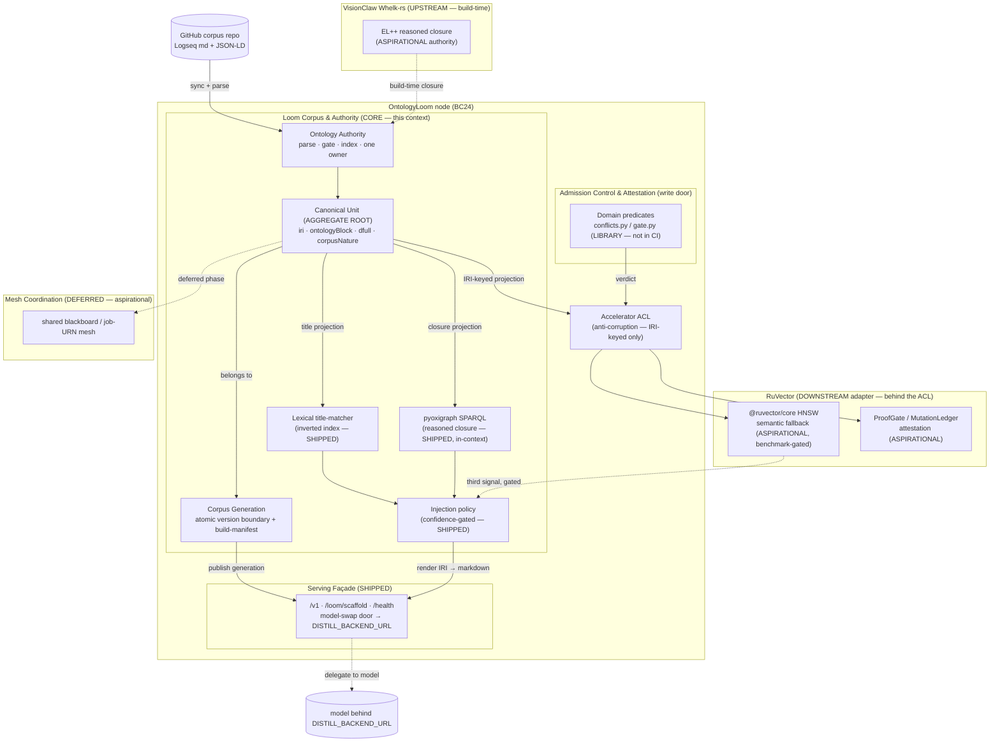

# DDD: Ontology Loom Bounded Context (rev)

**Subtitle:** canonical markdown unit, governed write door, and the accelerator boundary to RuVector
**Context name:** `OntologyLoom` (BC24 — provisional, pending BC catalogue update; see §11)
**Revision date:** 2026-08-16 (supersedes the 2026-08-11 revision in place)
**Author:** Loom platform team (tooling-allocation reframe, grounded in the OCP/RuVector research mesh)
**Status of this revision:** authority for the bounded-context model. It is subordinate to **ADR-136** (the tooling-allocation decision record) and operationalised by **PRD-026** (the consolidation requirements). It extends the keystone **ADR-135** (node boundary unchanged); it does not restate ADR-135's façade contract or PRD-025's product goal.

---

> **THE PRIZE (quoted verbatim — the non-negotiable driver of every decision below):**
>
> The one canonical, load-bearing artifact of this system is the per-IRI human-scrutible unit: one block of curated research prose (dfull, corpusNature: synthetic-ai-generated-human-directed) headed by its typed ontology relations (subClassOf, requires/enables/implements/uses/relatedTo/contrastsWith), that a human can read, review and audit end-to-end at single-entity granularity. Everything else — HNSW vectors, the lexical inverted index, pyoxigraph SPARQL, mincut, GNN, ProofGate ledgers — is an accelerator that indexes, finds, ranks and attests THAT unit. None of them ever becomes the thing served in its place, and none ever becomes the thing a human must trust instead of the markdown. We explicitly reject the GraphRAG/G-Retriever trajectory where knowledge degrades into opaque LLM community summaries or GNN-encoded subgraphs; our attribution granularity — one reviewable markdown per IRI, behind a propose→consistency-check→human-PR-merge gate — is the real, non-eroding moat (mesh Facet 4). Every decision in the three docs is subordinate to keeping this unit primary and legible; any design that reduces its legibility is a REGRESSION to be justified with a documented answer-quality trade, not a default.

---

## 0. What this revision changes

The 2026-08-11 DDD modelled the Loom around one new machine — the deferred distillation job — and correctly named the corpus-lifecycle ownership. It did not yet settle the tooling allocation the RuVector ecosystem forced open: which retrieval, reasoning and attestation machinery is the Loom's own and which is an accelerator sitting behind it. This revision settles that, and in doing so promotes a term the prior revision only implied to the centre of the model.

Three structural moves:

1. **The Canonical Unit becomes the aggregate root of this context** (§4, §7). The prior root was `CorpusGeneration` (an atomic snapshot). A Generation is now correctly modelled as a *versioned collection of Canonical Units*, not the primary aggregate. What a human reviews, what an accelerator indexes, and what the façade serves is always the per-IRI markdown-with-ontology block. The Generation is its version boundary; the Unit is the thing.
2. **The accelerator boundary is drawn explicitly** (§5, §6). RuVector (HNSW semantic fallback; ProofGate/MutationLedger attestation) sits *downstream* of the Canonical Unit behind an anti-corruption layer whose one job is to stop RuVector's index shape from ever leaking back into the canonical markdown. pyoxigraph stays *in-context* as the reasoned-closure SPARQL engine. Whelk-rs moves *upstream* as the build-time reasoning authority. None of the three is ever the served unit.
3. **The multi-agent coordination context is quarantined as deferred/aspirational** (§9). The prior revision already flagged it; this one models it as a named, separate context (`MeshCoordination`, WS-Q) with no shipped responsibility, so no reader mistakes it for a live capability. Today's only live consumer is the email gateway doing single-LLM RAG.

The node boundary from ADR-135, the atomic-Generation discipline, the distillation-job channel, and the BC-catalogue reconciliation all survive from the prior revision and are retained (§9.2, §11). This is a reframe of *authority and boundaries*, not a rewrite of the mechanics.

## 1. Shipped-vs-aspirational honesty table (mandatory, shared across ADR-136 / PRD-026 / this DDD)

No author of the three documents may contradict this table. "Shipped" means live in the repo today; "Library" means real, tested code that exists but is not an enforced control; "Aspirational" means designed, not built; "Deferred" means explicitly out of scope for the current phase; "Rejected" means evaluated and declined.

| Capability | Home (target) | Status | Honest note |
|---|---|---|---|
| Per-IRI markdown-with-ontology block as the **served canonical unit** | Loom | **Shipped** | This is THE PRIZE. Standing content asset; every accelerator resolves back to it. |
| `corpusNature` honesty metadata (`synthetic-ai-generated-human-directed`, generation, grounding.top_score) | Loom | **Shipped** | Emitted on every served answer and carried in corpus front-matter. |
| Confidence-gated selective-injection **policy** (`STRONG_MATCH_SCORE`, `MIN_INJECT_FRACTION`, `MIN_INJECT_SCORE` skip) | Loom | **Shipped** | Benchmarked product decision; no RuVector analogue. |
| Model-swappable `/v1` OpenAI-compatible serving façade | Loom | **Shipped** | Qwen3.8-27B behind it today; consumers hold the façade, model swaps behind it. |
| Lexical title-matcher (inverted index, 8,146 class titles, <50ms self-tested) | Loom | **Shipped** | First-tier retrieval signal; currently ahead of the shipped ecosystem equivalent. |
| pyoxigraph native-Rust SPARQL over the reasoned closure | Loom | **Shipped** | More capable than `@ruvector/graph-node` Cypher (label-scan-only). |
| Semantic/embedding fallback (HNSW) for OOV / paraphrase queries | RuVector (`@ruvector/core`, RuVector ADR-004) | **Aspirational** | The one real retrieval gap; today = silent no-injection below `MIN_INJECT_SCORE`. **Benchmark-gated** before default-on. |
| Single-source-of-truth build pipeline (one source derives ttl + scaffold + prose + HNSW) | Loom build pipeline | **Aspirational** | Today three materialisations (ttl 13M + scaffold-index.json 7.9M + prose-index.json 4.3M ≈ 25M) drift (the 8152-vs-5975 divergence). |
| Admission-control **domain predicates** (acyclicity, dupe-label, type-match, relation-contradiction) | Loom (`pipeline/gate.py`, `conflicts.py`) | **Library** | Real and tested; **NOT wired into any CI**. Enforcement is the aspirational delta. |
| Admission-control **attestation mechanics** (verdict → tamper-evident ledger) | RuVector `ProofGate<T>` / `MutationLedger` (RuVector ADR-047) | **Aspirational** | Re-platform the mechanics; keep the domain predicates in the Loom. |
| EL++ reasoning **authority** (build/CI-time closure over the TBox) | VisionClaw Whelk-rs (build-time) | **Aspirational** | Resolves ADR-135 D3-a (= PRD-025 §12 OD-1), selecting Option 1 (Whelk) over ADR-135's own Option-2 recommendation. Corpus has **zero `owl:disjointWith`** axioms — Whelk is authority for closure/subsumption, not a contradiction-catcher we can currently exercise. |
| EL++ reasoning at Loom **query time** | none (build-time only) | **Deferred** | `loom_graph.py` serves a pre-reasoned snapshot; Whelk does not run inside the Loom. |
| `@ruvector/graph-node` Cypher as a graph engine | rejected | **Rejected** | Label-scan-only; strictly weaker than the pyoxigraph SPARQL already running. |
| `ruvector-hybrid` / `mincut-bounded-rag` / `gnn-rerank` fusion | RuVector (if/when it ships) | **Deferred** | Nightly PoCs; mincut 4000× slower than top-k at n=3000. ruflo ADR-344 `hybridRetrieve()` is Proposed, flag-off, benchmark-gated. |
| Multi-agent coordination substrate (shared blackboard) | Loom/mesh (`MeshCoordination`, §9) | **Deferred** | DDD §9: not implemented. Only live consumer = email gateway single-LLM RAG. |

## 2. Ubiquitous language

The **Canonical Unit** is a new first-class term at the head of this table; everything else is retained from the prior revision or clarified against the accelerator boundary.

| Term | Meaning in this context |
|---|---|
| **Canonical Unit** | **The aggregate root of this context.** One per-IRI block of curated research prose (`dfull`, `corpusNature: synthetic-ai-generated-human-directed`) headed by its typed ontology relations (`subClassOf`, `requires`/`enables`/`implements`/`uses`/`relatedTo`/`contrastsWith`). Legible end-to-end by a human at single-entity granularity. It is what the façade serves, what every accelerator indexes, and what the write gate admits. Its identity is its **IRI**. It is never replaced by, and never subordinate to, any encoding of it. |
| **dfull** | The curated research-prose body of a Canonical Unit. AI-authored under human direction; labelled as such and never implied otherwise. |
| **Ontology block** | The typed-relation header of a Canonical Unit — the reasoned relations a human reads before the prose. Derived from the reasoned closure (Whelk-rs, build-time). |
| **Accelerator** | Any machine that indexes, finds, ranks or attests a Canonical Unit and resolves back to its IRI: the lexical inverted index, the HNSW semantic fallback, pyoxigraph SPARQL, ProofGate/MutationLedger. An accelerator is **never** the served or trusted unit (Invariant I-P1). |
| **Loom façade** | The one deployment-agnostic `/v1` contract consumers call. Model identity and corpus generation ride in *results*, never in the endpoint, so the model swaps (Qwen3.8-27B today) with zero consumer change (ADR-135). Serving/transport layer, orthogonal to the Canonical Unit. |
| **Injection policy** | The confidence-gated selective-injection product decision (`STRONG_MATCH_SCORE`, `MIN_INJECT_FRACTION`, skip below `MIN_INJECT_SCORE`). Decides *which* Canonical Units are injected; never alters the Units. No RuVector analogue. |
| **Corpus Generation** | An atomic, content-addressed **version boundary** over the whole set of Canonical Units at one GitHub commit: `{commitSha, buildId, generatedAt, pipelineVersion, artifacts:{path:{sha256,bytes,count}}}`. The unit of atomic publish and load. In this revision it is a *collection version*, not the aggregate root. |
| **Build Manifest** | `api/build-manifest.json`, written **last**; the record that makes a Generation atomically verifiable. |
| **Ontology Authority** | The single owner of parse → reason → gate → index per Generation. Downstream reasoners/indexers **derive from** it and are conformance-tested to equal it; they never re-derive. |
| **Reasoned closure** | The one authoritative EL closure over the TBox, computed **at build time** by Whelk-rs (§6.3). Serialised to `ontology-inferred.ttl`; queried in-context by pyoxigraph; projected into each Unit's ontology block. |
| **Accelerator ACL** | The anti-corruption layer around RuVector (§6.1). Its one job: an index shape (vector id, HNSW node, ledger row) never leaks back into a Canonical Unit. RuVector rows carry the IRI as primary key so every index addresses the same identity the human reviews. |
| **Admission control** | The write-time gate that blocks a bad write before it reaches the corpus. Two halves: **domain predicates** (Loom-owned — what a contradiction/duplicate MEANS here) and **attestation mechanics** (RuVector ProofGate/MutationLedger — that the gate ran, tamper-evidently). |
| **Distillation Job** | A job-URN-anchored request for an LLM-distilled, ontology-grounded summary over a corpus scope. The aggregate root of the deferred distillation channel (retained from the prior revision, §9.2). |
| **corpusNature** | `"synthetic-ai-generated-human-directed"` — carried on every served answer and distillate. The corpus is AI-authored under human direction; the system never implies otherwise. |

## 3. Purpose after consolidation

Define the bounded context that **owns the Canonical Unit lifecycle end-to-end and serves ontology-grounded intelligence behind one stable, model-swappable façade — with every retrieval, reasoning and attestation accelerator drawn explicitly as a boundary-crossing so none can be mistaken for the canonical asset.**

The durable job of the Loom, committed in ADR-136, is **not** to be a retrieval engine (that lead over the ecosystem is a temporary artifact of unfinished ecosystem capability, per mesh Facet 1). It is a **thin governed façade** whose three durable responsibilities are:

1. **Serving the Canonical Unit** — the per-IRI markdown-with-ontology block, legible end-to-end.
2. **Write-time admission control with domain-semantic authority** — the genuine non-eroding advantage, categorically different from read-time retrieval (mesh Facet 2).
3. **A confidence-gated injection policy** over a corpus that RuVector indexes and accelerates *strictly behind* the markdown.

Retrieval acceleration (HNSW semantic fallback) and attestation mechanics (ProofGate/MutationLedger) re-platform onto RuVector; the reasoned-closure SPARQL stays on pyoxigraph; EL++ authority moves to Whelk-rs at build time; the multi-agent mesh is an explicitly deferred phase.

## 4. The aggregate root: Canonical Unit

The Canonical Unit is the aggregate root of this context. This is the single most important modelling decision in the revision, and it exists to make THE PRIZE structural rather than aspirational.

| Field | Type | Invariant |
|---|---|---|
| `iri` | `IRI` | Identity. Every accelerator row, every SPARQL binding, every injected block resolves to this IRI. |
| `title` | `String` | The label the lexical matcher indexes. |
| `ontologyBlock` | `TypedRelations` | The reasoned relations (`subClassOf`, `requires`/`enables`/`implements`/`uses`/`relatedTo`/`contrastsWith`). Projected from the build-time reasoned closure. |
| `dfull` | `Markdown` | The curated research prose. Human-legible end-to-end. |
| `corpusNature` | `enum` | Always `synthetic-ai-generated-human-directed`. |
| `generation` | `CorpusGeneration` | The version boundary this Unit was published in. |

**Commands:**
- `Render()` — produce the served markdown-with-ontology block for a query hit. This is the canonical serving path; the façade injects the rendered block, never an encoding of it.
- `Project(closure)` — recompute `ontologyBlock` from a new reasoned closure at build time.
- `Admit(candidate)` — run admission control (§6.4) over a proposed new or edited Unit before it can join a Generation.

**Invariants (the ones that make THE PRIZE structural):**

- **I-P1 — The served unit is always the legible markdown block, never an opaque encoding.** Every retrieval path (lexical, HNSW, SPARQL) returns an IRI; the façade resolves that IRI to a Canonical Unit and injects the *rendered markdown-with-ontology block*. No path serves a vector, a GNN embedding, a community summary, or any representation a human cannot read. Violating this is the regression THE PRIZE forbids.
- **I-P2 — No accelerator is a new copy.** Every index (lexical inverted index, HNSW, pyoxigraph store) is a *projection* of the one single-source-of-truth build, keyed by IRI. Adding a 4th independent materialisation is prohibited (§6.5). Re-embed on promote (delta-diffed), not full re-embed per build.
- **I-P3 — Attribution granularity is one Unit per IRI.** The corpus never collapses multiple entities into a shared summary (the GraphRAG trajectory) or encodes a subgraph into a soft prompt (the G-Retriever trajectory). One reviewable markdown per IRI is the non-eroding moat and must not degrade into an inspection-resistant representation.
- **I-P4 — Legibility is sacrificed only with a documented quality trade.** Any design that reduces the Canonical Unit's end-to-end human-readability is a regression to be justified against measured answer quality, not a default to be accepted.

## 5. Bounded contexts after consolidation

The Loom is one node; within and around it the responsibilities partition into five contexts. Two are shipped, two are aspirational-but-designed, one is deferred.

| Context | Responsibility | Owns | Status |
|---|---|---|---|
| **Loom Corpus & Authority** (this context, core) | The Canonical Unit lifecycle: parse → reason → gate → index → publish → serve. Aggregate root = Canonical Unit; version boundary = Corpus Generation; single owner = Ontology Authority. | The markdown, the injection policy, the lexical matcher, the pyoxigraph in-context SPARQL, the atomic Generation. | **Shipped** (serving, lexical, SPARQL, policy, corpusNature). Authority-consolidation (one reasoner, one index, SSOT) is **Aspirational**. |
| **Retrieval / Index Acceleration** (downstream adapter) | Semantic-fallback recall for OOV / paraphrase queries the lexical matcher misses; future hybrid fusion if it ships and beats the baseline. | Nothing canonical. Holds **projections** of Canonical Units keyed by IRI. | **Aspirational** (HNSW behind the Accelerator ACL, benchmark-gated). Hybrid/mincut/gnn = **Deferred**. |
| **Admission Control & Attestation** (write door) | Block a bad write before it reaches the corpus; attest tamper-evidently that the gate ran. | Domain predicates (Loom); attestation mechanics (RuVector). | Predicates = **Library** (exist, tested, not in CI). CI enforcement + ProofGate re-platform = **Aspirational**. |
| **Serving Façade** (published contract) | The stable model-swap door: `/v1` OpenAI-compatible; `/loom/scaffold` + `/health` retrieval (no model); confidence-gated injection then delegate to the model behind `DISTILL_BACKEND_URL`. | The endpoint contract; the injection execution. | **Shipped**. |
| **Mesh Coordination** (deferred region) | A shared blackboard multiple agents read and write, coordinated by job URNs and signed result envelopes. | Nothing today. | **Deferred / aspirational** (§9). Not a shipped property. |

### 5.1 Context map

The one arrow to read carefully: `POL -->|render IRI → markdown| F`. Every retrieval signal (lexical, SPARQL, and the gated HNSW third signal) converges on the injection policy, which resolves the winning IRIs to Canonical Units and renders the markdown-with-ontology block. The façade serves that block. No accelerator output reaches the façade in its own shape (I-P1).

## 6. Strategic patterns — the accelerator boundary

### 6.1 Loom Corpus & Authority → RuVector: Anti-Corruption Layer (the load-bearing boundary)

**Relationship:** Customer/Supplier with a **hard Anti-Corruption Layer (the Accelerator ACL)**. The Loom is the customer; RuVector is a downstream index/attestation supplier. The ACL exists so RuVector's index shape never leaks into the canonical markdown.

Binding obligations of the ACL:

- **IRI-keyed only.** Every RuVector row (HNSW vector, candidate row, ledger entry) carries the **IRI** as its primary key, never a random UUID and never a RuVector-internal handle. Vector search, any future graph traversal, and the Canonical Unit all address the same identity (mesh Facet 5 discipline: "content-addressed by meaning").
- **Projection, never source.** RuVector holds *projections* of Canonical Units. A projection is derived from the SSOT build (§6.5) and is disposable — dropping the whole RuVector namespace and rebuilding it from the corpus must produce an equivalent index. If RuVector ever became the only place a fact lived, the ACL has failed.
- **Ranking crosses the boundary; representation does not.** RuVector may return `[(iri, score)]`. It may **not** return content the façade would serve. The Loom resolves each IRI to its Canonical Unit and renders the markdown itself (I-P1). An embedding, a nearest-neighbour blob, or a ledger proof never crosses into the served answer.
- **In-process projection, not cloud memory (ADR §3).** The corpus semantic-fallback HNSW is an **in-process `@ruvector/core` index, network-free**, built from the SSOT (§6.5) and held alongside the served corpus. It is **not** a `ruvector-postgres` namespace reached over the `mcp__claude-flow__memory_*` tools — that MCP/Postgres path is the *claude-flow agent-memory discipline* (durable cross-agent memory, where raw SQL/CLI bypasses the embedding pipeline and is prohibited), a separate concern from the corpus index. Conflating the two is exactly the contradiction ADR §3 resolves in favour of the in-process projection. The corpus HNSW is rebuilt from the corpus on promote (I-P2), never authored directly, so it can never become a source of record.

### 6.2 Loom Corpus & Authority → pyoxigraph: in-context, Shared Kernel

**Relationship:** pyoxigraph is **in-context**, not a boundary crossing. The reasoned-closure SPARQL engine lives inside the Loom (`loom_graph.py`) and stays there. It is genuinely more capable than `@ruvector/graph-node` Cypher, which is label-scan-only (every relationship pattern, `WHERE` clause and aggregation returns empty). Installing graph-node as a graph engine is a **regression dressed as an upgrade** and is explicitly rejected (§1 honesty table). SPARQL queries return IRIs that address the exact same Canonical Unit identity every other accelerator addresses.

### 6.3 VisionClaw Whelk-rs → Loom: Upstream Supplier (build-time reasoning authority)

**Relationship:** Whelk-rs is **upstream** of the Loom, a Customer/Supplier where the Loom conforms to Whelk-rs's closure. This resolves **ADR-135 D3-a** (= PRD-025 §12 OD-1): **the canonical reasoner is VisionClaw Whelk-rs, run at build time** — selecting **Option 1 (Whelk)**, and thereby overriding ADR-135's own **Option-2** recommendation. The duplicate `pipeline/reason.py` BFS transitive closure (`ontology-inferred.ttl`) is retired in favour of the one authoritative closure.

Honest caveat, carried verbatim from the research and the §1 table: the corpus has **zero `owl:disjointWith` axioms**, so a DL reasoner has structurally nothing to catch beyond what the non-DL `conflicts.py` already catches. Whelk-rs is the authority for **closure and subsumption**, not a contradiction-catcher we can currently exercise. It runs at build/CI time only; it does **not** run inside the Loom at query time (`loom_graph.py` serves the pre-reasoned snapshot). One authoritative closure means one reasoned ontology block per IRI for the human to read, with no reasoner drift.

### 6.4 Admission Control: domain predicates stay Loom-owned, attestation mechanics move to RuVector

**Relationship:** a split-ownership write door. This is the genuine non-eroding advantage (mesh Facet 2), and the split is deliberate.

- **Domain predicates stay in the Loom** (`pipeline/gate.py`, `conflicts.py`): acyclicity, duplicate-label, type-match, relation-contradiction. These are domain-semantic — what a contradiction or a duplicate *means* for this ontology. RuVector's proof-gate has, and should have, zero opinion about ontology vocabulary. **Honest status:** these predicates are a real, tested **library**, invoked by CLI, **not wired into any CI**. An agent can today write straight past the gate. Enforcement (wiring the gate into the publish CI as a hard control) is the aspirational delta, owned by PRD-026.
- **Attestation mechanics move to RuVector** `ProofGate<T>` / `MutationLedger` (RuVector ADR-047): the unattested Python `CheckResult` becomes a `ProofRequirement::InvariantPreserved` obligation routed through ProofGate, replaced by a tamper-evident append-only ledger entry. ADR-047's types are domain-agnostic, so this is a straight mechanics upgrade with no domain-knowledge cost. It attests *that the gate ran*; the Canonical Unit remains the human-facing artifact.

The write flow: a proposed Canonical Unit runs the Loom's domain predicates → the verdict is attested via ProofGate (through the Accelerator ACL) → on pass, it proceeds to the `propose → consistency-check → human PR merge` door → merge into a new Generation. The human-merge gate is not replaced by attestation; attestation records that the machine checks ran before the human saw the diff.

### 6.5 Single-source-of-truth build pipeline

**Relationship:** an internal invariant of the Loom Corpus & Authority context, and the sharpest real waste the research found. Today three materialisations of the same graph coexist — `ontology.ttl` (13M) + `scaffold-index.json` (7.9M) + `prose-index.json` (4.3M) ≈ 25M — and they drift (the 8152-vs-5975 class-count divergence). This is a build-pipeline / SSOT problem, not a retrieval-algorithm problem; it persists after any RuVector migration unless the derivation is restructured.

The rule (Invariant I-P2): **one source derives ttl + scaffold + prose + HNSW.** Any new index, including the HNSW semantic fallback, is a projection of that one source or it becomes a 4th copy. Re-embed on promote — delta-diffed against the prior Generation, stamping each row with `generation_id` so freshness is a cheap equality check — not a full corpus re-embed per build.

### 6.6 Retrieval fusion: benchmark before default-on

**Relationship:** a guardrail on the Retrieval/Index Acceleration context. Adding the HNSW semantic fallback as a **third signal** alongside lexical + precomputed-graph MUST beat the lexical baseline on the multivariate bench (in-domain recall **and** general-question non-jaggedness) before it becomes a default. The standing counter-example is our own over-retrieval result: Δ=-0.40 [-0.58,-0.22], n=285, 5 models, worst on the weakest model (haiku -1.30) — a documented lost-in-the-middle / irrelevant-skew distraction. Naive fusion can underperform; budget and gating matter more than raw recall. `ruvector-hybrid` / `mincut-bounded-rag` / `gnn-rerank` are revisited only if and when they ship AND beat this benchmark.

## 7. Aggregates & invariants (consolidated)

### 7.1 Aggregates

| Aggregate | Root of | Key invariants |
|---|---|---|
| **Canonical Unit** (§4) | The corpus. **The aggregate root of this context.** | I-P1 (served unit always legible markdown), I-P2 (no accelerator is a new copy), I-P3 (one Unit per IRI), I-P4 (legibility traded only with documented quality justification). |
| **Corpus Generation** | The atomic version boundary over all Units. | I9 (atomic publish — `mirror.sh` writes then renames; consumers never see a mixed build); manifest written last; immutable once published (new corpus = new `commitSha`). |
| **Ontology Authority** | parse → reason → gate → index per Generation. | I1 (one authority, no drift — every downstream reasoner/indexer derives from it and is conformance-tested to equal it; `ConformanceDrift` is a hard failure, never a warning). |
| **Distillation Job** (retained, §9.2) | The deferred distillation channel. | I5 (content-addressed identity), I3 (`scaffold_engaged=false` quarantined, never grounded), concurrency 1. |

### 7.2 Invariants that bind all authors

The prize-invariants (I-P1…I-P4, §4) plus the operational invariants below are shared across ADR-136, PRD-026 and this DDD. None may be contradicted.

- **I1 — One authority, no drift.** For any Generation, exactly one Ontology Authority output. VisionClaw `:inferred` ≡ published `ontology-inferred.ttl` ≡ Whelk-rs closure for the same `commitSha`. The 8152-vs-5975 drift is structurally impossible once conformance is a gate.
- **Benchmark-first** (§6.6). No retrieval-fusion change becomes a default without beating the lexical baseline on the multivariate bench.
- **SSOT** (§6.5, I-P2). Every index derives from one source; no 4th copy; re-embed on promote, delta-diffed.
- **pyoxigraph stays** (§6.2). SPARQL over the reasoned closure is native-Rust, in-context; graph-node is not installed as a graph engine.
- **Honest labelling** (§1). The gate is a library not wired to CI; Whelk-rs does not run inside the Loom; the corpus has zero `owl:disjointWith`; ProofGate re-platforming and the mesh are deferred. No aspirational capability is written as shipped.
- **Domain semantics in the Loom, generic mechanics in RuVector** (§6.4). Admission-control predicates stay Loom-owned; only domain-agnostic attestation/ledger mechanics re-platform onto ProofGate/MutationLedger.
- **I3 — `scaffold_engaged=false` is never grounded** (retained). An envelope with `scaffold_engaged=false` is fail-labelled and quarantined, never delivered or presented as ontology-grounded.
- **I8 — Corpus honesty** (retained). Every served answer and distillate carries `corpusNature: synthetic-ai-generated-human-directed`.

## 8. Domain events

| Event | Producer | Consumer(s) | Channel |
|---|---|---|---|
| `GenerationPublished` | Corpus Generation | `mirror.sh` (cloud replica), VisionClaw `load-generation` | In-process + HTTP |
| `IndexProjected {iri, kinds}` | Ontology Authority | Lexical matcher, pyoxigraph, HNSW (via ACL) | In-process |
| `ConformanceDrift {client, commitSha, delta}` | Ontology Authority | CI hard-fail, operator | In-process |
| `AdmissionVerdict {iri, passed, ledgerRef}` | Admission Control | Publish gate, ProofGate ledger (via ACL) | In-process + MCP |
| `UnitServed {iri, generation, injected_tokens, top_score}` | Serving Façade | Provenance / telemetry | In-process |
| `JobDelivered` (retained) | Distillation Job | Recombine worker, reconciliation janitor | RuVector + bead |

`AdmissionVerdict` and `IndexProjected` are the two boundary-crossing events; both carry IRIs only, never Canonical-Unit content, in keeping with the Accelerator ACL (§6.1).

## 9. The deferred region: Mesh Coordination (aspirational — not shipped)

> **Status:** aspirational. Not implemented. Today's only live consumer of the Loom is the email gateway doing single-LLM RAG (`REASONER_BASE_URL = http://loom:8080/v1`). There is no observed pattern of multiple distinct agents asserting typed claims into the corpus and other agents reading them back for coordination.

The "shared substrate for a multi-agent mesh" framing is the weakest plank in the case for a separate node, and the research (mesh Facet 3) is explicit that it describes the design's aspiration, not an operating capability. This revision models it as a **named, separate context** with **no shipped responsibility**, precisely so no reader mistakes it for live. When it is built, it must still resolve every read and write to the same per-IRI Canonical Unit (I-P3); it does not get to invent a coordination-only representation that bypasses the markdown.

### 9.1 Why it is quarantined, not deleted

It has a legitimate home in the roadmap (the WS-Q phase, per PRD-026). Recording it here gives that future claim a place to land without letting it contaminate the shipped-vs-aspirational honesty of the rest of the document. The honest present-tense description of the Loom is a **single-consumer governed façade**, not a coordination hub.

### 9.2 Retained: the deferred Distillation channel

The prior revision's distillation-job machinery (`DistillationJob`, `ResultEnvelope`, the HP `jobd` pull-worker, the reconciliation janitor, the consumer MCP tools) is retained as a **separate deferred channel**, not folded into the core serving path. Its aggregates and invariants (content-addressed job identity I5; `scaffold_engaged=false` quarantine I3; closed-done ⇒ payload-retrievable I2; the no-synchronous-await law) are unchanged and remain in the prior revision's §5–§10 for reference. It is a Phase-1/Phase-2 build order, not a shipped capability, and it delivers into the RuVector `ontology-distilled` namespace **through the Accelerator ACL** like any other projection. The distillate is a summary *over* Canonical Units; it never becomes a Canonical Unit without passing admission control and the human-merge gate.

## 10. Cross-reference discipline (repo-qualified)

The three documents cite across repos where identical identifiers collide. All citations are repo-qualified to avoid the two-PRD-022 / two-ADR-050 ambiguity PRD-025's citation discipline flagged.

| Citation | Repo | Meaning here |
|---|---|---|
| **ADR-135** | loom | Keystone Loom-node ADR. Node boundary unchanged; §5 retrieval posture superseded by ADR-136; open decision **D3-a** (reasoner) resolved by ADR-136 (selecting Option 1, overriding ADR-135's Option-2 recommendation). |
| **ADR-136** | loom | The tooling-allocation decision record. The authority this DDD cites for every allocation. |
| **PRD-025** | loom | The reframed capstone product goal. This DDD does not re-derive it. |
| **PRD-026** | loom | The consolidation requirements + WS build order + multivariate evidence bars. Owns CI enforcement of the gate. |
| **ADR-004** | RuVector | HNSW, production. The semantic-fallback engine (§6.1). |
| **ADR-047** | RuVector | `ProofGate<T>` / `MutationLedger`. The attestation mechanics (§6.4). |
| **ADR-344** | ruflo | `hybridRetrieve()`. Status **Proposed**, feature-flag-off, benchmark-gated. Cited as **deferred**, not adopted (§6.6). |
| **PRD-022 (semantic-trust-layer)** | VisionClaw | Provenance-graph constraints (`urn:ngm:graph:provenance`). |
| **PRD-022 (semantic-integrity-provenance-decisions)** | agentbox | URI/DID grammar authority (Conformist target for identifiers). |
| **ADR-050 (pod-backed-kgnode)** | VisionClaw | Distinct from the agentbox ADR-050 below. |
| **ADR-050 (decision-elevation)** | agentbox | Cited as **pattern precedent only** — it is decision elevation, not corpus elevation. |
| **Whelk-rs** | VisionClaw | Build-time EL++ reasoning authority (§6.3). |

## 11. BC catalogue reconciliation (retained)

The BC-numbering collision recorded in the prior revision stands: two contexts historically claimed BC22 (`ddd-xr-godot-context.md` and `ddd-semantic-trust-layer-context.md`). The proposed resolution is unchanged — BC22 = SemanticTrustLayer (earlier-dated claimant, the one BC24 depends on by number), BC23 = SemanticIntegrity & Provenance (agentbox grammar authority), BC24 = OntologyLoom (this document), BC25 = XR Godot (renumbered, lowest blast radius). This remains a proposal for the catalogue owner to ratify; BC24 cites BC22 and BC23 by number and those numbers must be unambiguous before ratification.

## 12. Open decisions

The reasoner and tooling-allocation open decisions — **ADR-135 D3-a** (= PRD-025 §12 OD-1) and its siblings — are **resolved** by ADR-136 and reflected above (canonical reasoner = Whelk-rs at build time, **selecting Option 1 and overriding ADR-135's Option-2 recommendation**; retrieval acceleration = RuVector HNSW behind the Accelerator ACL; gate attestation = RuVector ProofGate/MutationLedger). What remains open for the operator:

1. **Gate-in-CI enforcement timing.** The domain predicates are a tested library today; PRD-026 owns wiring them into the publish CI as a hard control. When does the gate become enforced rather than opt-in?
2. **HNSW default-on trigger.** The benchmark bar (§6.6) is defined; the measured result that flips HNSW from behind-the-flag to default is not yet run. Who runs it, against which multivariate suite?
3. **Deployment topology default (ADR-135).** Deployment A (HP host, GPU-local façade + model) vs Deployment B (Docker sidecar on `visionclaw_network`). Both expose the identical façade; which is the reference default for the capstone demo?
4. **Mesh Coordination trigger.** What concrete second consumer (beyond the email gateway) justifies promoting the deferred §9 region into a live phase?
5. **Distiller-provider allowlist bootstrap** (retained). N=1 provider today. The admission process when a second provider lands is the honest trigger for any "generalised platform" claim.